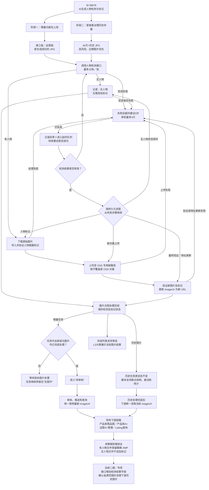

# M-36678【AI生图】[美工+运营]亚马逊平台紧急要求检测并标记是否有AI生成人物（责任人：徐强）

禅道需求：https://pm.zhcxkj.com/zentao/story-view-36678.html

GitHub PRD：https://github.com/xuqiang97/ai-image-prd-hub/blob/main/prd/2026-07/M-36678-ai-person-detection-marking/README.md

## 需求概要图

本需求采用“同一需求、两个实施阶段、一套合规处理链路”的方式实施：先上线增量自动检测和标记，再紧接着执行历史存量刷数。



## 修改纪要

| 日期 | 版本 | 修改人 | 主要修改点 |
|---|---|---|---|
| 2026-07-28 | V1.0 | 徐强 | 新建 PRD，明确 AI 生图增量自动检测、人物标记、任务门禁、页面展示及历史存量治理方案。 |

## 调研纪要

| 日期 | 业务部门 | 角色 | 调研对象（干系人） | 调研内容和结论 |
|---|---|---|---|---|
| 2026-07-28 | 暂无 | 暂无 | 暂无 | 本期未单独开展美工、运营业务访谈；需求依据为亚马逊 2026-07-23 官方通知、内部转发材料及产品确认口径，详见业务背景和参考资料。 |

## 业务背景和价值

亚马逊于 2026-07-23 发布平台通知：在商品信息和 A+ 商品描述中使用包含 AI 生成逼真人物的图片前，需要通过指定元数据添加披露标记。

关于亚马逊平台已经发布内容的追溯范围，目前尚未取得最终业务确认。最新业务侧消息显示，平台可能进一步要求对部分已发布历史内容追溯添加标记，可能包括 2026 年 6 月起发布的内容；具体起始时间、适用范围和处理口径均以业务后续核实的官方要求为准。业务完成确认后，需另行组织产品库、A+ 管理、Listing 等相关下游共同参加的专项会议，确定已保存、已加工、已推送或已发布历史图片的更新、替换或重新推送方案。

无论亚马逊对已发布历史内容的最终追溯口径如何，AI 生图系统内的历史图片今后仍可能被 Listing 实时查询，或在审核后重新推送；对亚马逊而言，这些后续取用行为属于新上传风险。因此，本系统必须在本需求内同时治理增量图片和内部历史存量，越早处理越能降低后续业务使用风险。

不遵守平台要求可能导致 ASIN 链接被移除、卖家内容无法发布或详情页内容展示不完整。本需求目标是让增量图片在进入业务审核前完成自动检测、必要标记和结果留痕，并通过专项刷数治理系统内历史图片，避免业务审核通过或旧图后续重新取用时因合规处理未完成而产生平台风险。

本系统生成的图片均属于 AI 生成图片，算法团队已确认本次接入的自研人物检测接口检测目标即“逼真的 AI 生成人物”。系统直接使用该接口的人物判断结果，不再自行区分人物生成方式或设置二次判断阈值：

- 检测为“有人物”时，表示检测到逼真的 AI 生成人物，系统统一执行披露处理。
- 检测为“无人物”时，不写入人物披露标记。
- 本期不使用检测分数自行设置二次阈值；算法检测范围或口径发生变化时，算法团队需提前同步系统后端和产品。

## 需求概述

本需求同时覆盖美工版和运营版 AI 生图系统，包含两个连续实施阶段：

1. **增量功能上线**：在现有“生图中 → 待审核”之间插入人物检测、必要标记、结果验证和图片地址更新。任务内任何一张生成成功的图片未完成处理时，整个任务继续停留在“生图中”。
2. **历史存量治理**：增量功能上线后，研发紧接着编写并执行历史刷数脚本，复用同一套检测和标记规则处理四十多万张历史 JPG，避免历史图片今后被重新取用时不符合平台要求。

本期同时补齐：

- 图片表的人物检测结果；
- 必须具备的标记处理状态语义（推荐独立字段），以及推荐新增的原始图片地址；
- 美工版、运营版“查看已完成生图”列表的图片维度筛选；
- 美工版、运营版 L3 沉浸式大屏的单图检测结果展示；
- 四条现有下游链路对最新 `imageUrl` 的使用及 XMP 标记保留验证。

## 本期范围与边界

### 本期范围

- 美工版、运营版新生成成功的 JPG 图片。
- 美工版、运营版 AI 生图系统内符合条件的历史 JPG 图片。
- 人物检测、必要标记、验证、新 OSS 图片上传、`imageUrl` 更新和任务流转门禁。
- 已完成生图列表筛选及 L3 沉浸式大屏结果展示。
- 历史刷数脚本、断点续刷、失败重试、进度统计和异常收口。
- 美工商品图、美工 A+ 图、运营 A+ 图、运营非 A+ 商品图四条现有下游链路的 XMP 标记端到端保留验证。

### 不在本期范围

- AI 视频检测和标记，由 AI 视频对应需求另行处理。
- 已经保存、加工、推送或应用到产品库、A+ 管理、Listing 及亚马逊平台等下游环节的历史图片自动替换或重新推送。该范围待业务确认亚马逊官方追溯口径后，另行组织下游专项会议确定方案。
- Listing 查询接口及各下游推送接口新增人物检测结果字段。
- “检测未完成的图片进入待审核后再拦截审核”、定期页面扫描、业务手工重试等审核侧改造。
- PNG 图片的正式处理和验收；本期数据已确认全部为 JPG，但实现结构需为后续支持 PNG 预留扩展能力。

## 功能需求

### 1. 增量处理节点和任务门禁

现有主流程为：

`建任务 → 生图中 → 待审核 → 待推送 → 已完成`

本期调整为：

`建任务 → 生图中 → 人物检测及必要标记 → 待审核 → 待推送 → 已完成`

处理规则：

1. 仅处理已经成功生成并取得有效图片地址的 JPG；生成失败图片继续沿用现有失败逻辑，不因本需求改变状态或补偿方式。
2. 图片上传至现有 OSS 并取得原始图片 URL 后，调用内部人物检测接口。
3. 单张图片检测成功且为“无人物”时，保存检测结果“无人物”，标记处理结果为“无需标记”，原 `imageUrl` 保持不变。
4. 单张图片检测成功且为“有人物”时，执行下载原图、写入标记、写后验证、上传新 OSS 对象、验证新地址、更新 `imageUrl` 的完整链路。
5. 只有“现有生成流程已达到原有可流转条件”和“任务内全部生成成功图片均完成合规处理”两个条件同时满足，任务才允许从“生图中”进入“待审核”。
6. 任意一张图片仍处于未检测、检测失败、标记失败、上传失败、验证失败或地址更新失败时，整个任务继续停留在“生图中”，不得提前进入“待审核”，也不得自动降级为不检测直接放行。
7. 两个放行条件全部满足后，系统自动沿用现有逻辑进入“待审核”且只流转一次，不要求业务额外操作。
8. 检测结果和标记结果必须绑定同一份原始图片。处理记录需保存源 URL 及 OSS ETag、VersionId、内容摘要或研发选定的等价稳定源标识；除本需求将 `imageUrl` 更新为已标记新 URL 外，如果源图片内容或源对象版本发生变化，原检测与标记结果均失效，必须重新处理。

本期采用任务级强门禁，避免业务已经完成整任务审核后，才发现某张图片因合规处理未完成而无法推送；同时不改造现有“任务维度全部审完后再推送”的审核状态模型。

### 2. 人物检测接口接入

内部接口：

`POST /api/person_presence/detect`

内网文档：

http://showdoc.zhcxkj.com/web/#/79/7147

已确认接口能力：

- 请求支持一次传入多张图片的 `id` 和 `url`。
- 单次请求最多 32 张图片。
- 当前实测 32 张约 5 秒，算法团队建议先按 32 张一批串行调用。
- 超过 32 张时必须拆分为多批处理，并在任务维度汇总全部批次结果。
- 请求 `id` 使用稳定且批内唯一的图片记录标识；响应按 `id` 关联原图片，禁止按数组下标强行对应。
- `items[].status=success` 时读取 `items[].is_human`。
- HTTP 请求整体成功不等于每张图片都检测成功，必须逐项判断 `items[].status`。
- `items[].status=failed` 时读取单图 `error_code`、`message` 并按失败逻辑处理。
- 响应缺少请求图片、返回重复 `id`、未知 `id`、无法唯一关联、结构非法、整体超时或非 200 时，对受影响图片按检测失败处理，不得默认成功。
- 日志和处理记录需保存接口 `request_id`、检测策略名称、版本及检测完成时间，便于关联排障；带鉴权参数的完整 URL 不得直接写入普通日志。
- `evidence.score` 为模型检测分数，不是校准后的业务概率，本系统不得自行基于该字段增加人物判断阈值。

接口鉴权信息由算法团队通过安全配置另行提供，禁止将真实 `Authorization`、Token、Cookie、密钥写入代码、GitHub 文档或普通业务日志。上线前必须轮换本需求交流及联调阶段使用过的检测接口凭证，使旧凭证失效；新凭证通过安全配置托管，并由系统后端与算法团队确认服务间访问控制和传输安全方案。

系统后端与算法团队需在上线及历史刷数前共同确认：

- 在线增量与历史刷数同时调用时的接口容量和显卡负载；
- 超时设置、单批上限及可接受调用频率；
- 图片 URL 的下载权限、有效期、防盗链及异常响应处理；
- 算法版本变化时的兼容和通知方式。

### 3. 人物披露标记及验证标准

有人物图片必须写入以下精确标记：

```text
XMP-dc:Subject
└─ rdf:Bag
   └─ rdf:li = contains-synthetic-performer
```

处理要求：

1. `contains-synthetic-performer` 按区分大小写的完整字符串处理。
2. 写入前先读取现有 Subject；仅在缺少目标值时追加，不得删除或覆盖其他已有 Subject 关键词。
3. 重复处理同一图片时不得重复追加相同值，必须保持幂等。
4. 写入后必须重新读取字段及原始 XMP，确认目标值位于正式 Dublin Core 与 RDF namespace 下的 `rdf:Bag/rdf:li`。
5. Windows 属性页中看到“标记”仅可作为辅助观察，不能替代原始 XMP 结构验证；其他相似字段也不能作为验收依据。
6. 只有“写入成功 + 原始 XMP 结构验证通过”才算本地标记写入验证通过；完整链路的“已标记并验证通过”还必须满足最终 OSS 对象回读验证和 `imageUrl` 更新成功。
7. 已经包含正确标记的图片再次进入处理链路时，不重复写入：如当前对象已属于本需求专用新路径且验证通过，直接复用；如仍位于原图或其他非专用路径，则将已验证文件上传至专用新路径后再更新 `imageUrl`。
8. 不得自动移除已经存在的正确标记。标记处理只修改必要元数据，不得裁剪、缩放、旋转图片或进行无必要的 JPG 二次有损编码，图片尺寸、方向和可见内容必须保持不变。

“验证通过”仅表示图片满足本需求约定的标记字段和结构，不代表法律意见或亚马逊最终审核结论。

### 4. OSS 新对象和图片地址更新

#### 4.1 强制规则

1. 有人物图片写入标记后，必须上传为 OSS 中的**新对象**，并使用与原图分离的专用标记图目录，不得只依靠文件名变化区分原图和标记图。建议在现有业务路径前部增加独立文件夹层级，例如 `ai-person-marked`；具体名称和前置层级由研发结合现有规范确定。
2. 严禁使用原 OSS 对象路径覆盖上传，原始对象本期继续保留。
3. 新对象上传后，必须通过最终 OSS URL 或对象重新下载并验证：URL 可访问、JPG 可正常解析、原始 XMP 中仍存在精确标记、图片尺寸和方向正确。上述验证全部通过前不得更新数据库 `imageUrl`。
4. 最终 OSS 对象验证通过后，将 `imageUrl`、检测状态、标记处理状态及新旧 URL 映射原子更新，或使用能够识别并补偿中断状态的等价方案；不得出现 URL 已更新但状态未成功，或状态显示成功但 URL 仍指向未标记原图。
5. 任一步骤失败时，`imageUrl` 保持上一次有效地址，不得写入空值、临时地址或未验证地址。因故障回滚为原 URL 时，图片必须同时恢复为合规未完成状态；增量任务不得进入待审核，历史图片不得计入治理完成。
6. 重试必须幂等，不能因同一图片多次重试产生不可控的大量无主 OSS 对象；同一图片同一时刻只能由一个处理器执行。
7. 需覆盖“新对象已上传但数据库未更新”“`imageUrl` 已更新但成功状态未落库”等进程中断场景，重启后能够识别现状并继续完成或安全补偿。

#### 4.2 新对象路径命名建议

研发需在实施前明确并评审专用路径规则，重点满足：

- 在现有业务路径前部增加独立文件夹层级，使路径能够直接识别为“AI 人物已标记图”；例如使用 `ai-person-marked` 业务目录，具体层级沿用现有 OSS 规范。
- 使用图片记录 ID、原对象稳定标识或等价业务键生成可追踪的对象名。
- 同一原图、同一处理版本重复执行时复用稳定目标，或采用可控版本号，避免每次随机生成新对象。
- 日志或处理记录能够关联原 URL、新 URL、图片记录 ID 和处理批次，便于排障和回滚。

以上为命名策略要求和实现建议，具体对象 Key、目录名称和前置层级由研发结合现有 OSS 目录规范确定；“使用专用标记图目录”和“不得覆盖原对象”是不可放宽的强制规则。

### 5. 图片表字段与状态

#### 5.1 必须新增：人物检测结果

图片表增加“AI 生成人物检测结果”，至少支持：

| 状态 | 含义 |
|---|---|
| 未检测 | 默认值；兼容历史存量，尚未取得有效检测结果。 |
| 有人物 | 检测成功，接口返回图片中存在人物。 |
| 无人物 | 检测成功，接口返回图片中不存在人物。 |
| 检测失败 | 已调用检测接口但单图未取得有效结果，用于异常留痕和后续重试。 |

业务状态名称按上表统一；数据库枚举值和字段名由研发按现有规范确定。历史记录中的 `null`、空值在查询、筛选、展示和历史刷数时统一视为“未检测”；研发可选择迁移时回填或查询时映射，但各端口径必须一致，不得漏数。

#### 5.2 必须具备：标记处理状态语义（推荐独立字段）

为避免“检测到有人物”和“已经完成合规标记”被混为同一状态，本期必须具备以下可持久化、可查询的标记处理状态语义，并强烈建议在图片表中单独保存：

| 状态 | 含义 |
|---|---|
| 未处理 | 尚未进入标记处理，或人物检测尚未完成。 |
| 无需标记 | 检测结果为无人物，无需写入披露标记。 |
| 已标记并验证通过 | 标记写入、原始 XMP 验证、新 OSS 对象验证及 `imageUrl` 更新均已完成。 |
| 标记失败 | 标记、上传、验证或地址更新链路尚未成功，需继续重试。 |

独立字段是本期强烈推荐方案，便于任务门禁、异常排查、历史刷数断点恢复和后续二期扩展。若研发因紧急上线不单独建字段，必须以等价的持久化处理记录区分上述状态，并让任务门禁和历史脚本读取同一状态来源；不能只依赖日志、临时队列状态或 `imageUrl` 是否变化推断。

#### 5.3 推荐新增：`originalImageUrl`

推荐图片表增加 `originalImageUrl`，职责如下：

- `originalImageUrl`：保存首次上传 OSS 后取得的原始生成图 URL，后续不随标记处理变化。
- `imageUrl`：保存业务后续实际使用的 URL。

推荐增量写入方式：

1. 原图上传 OSS 后，同时写入 `originalImageUrl=原图URL`、`imageUrl=原图URL`。
2. 人物检测统一读取 `originalImageUrl`。
3. 无人物时，`imageUrl` 继续等于原始 URL。
4. 有人物时，标记图上传新对象并验证成功后，将 `imageUrl` 更新为新 URL，`originalImageUrl` 保持不变。

推荐历史处理方式：

1. 历史记录 `originalImageUrl` 为空时，先将当前有效 `imageUrl` 保存为 `originalImageUrl`。
2. 后续基于 `originalImageUrl` 检测和标记。
3. 有人物且处理成功后，仅更新 `imageUrl`。

该字段是重点推荐但不作为本期强制上线条件。若研发继续只使用 `imageUrl`，至少必须：

- 始终使用新 OSS 对象，不覆盖旧对象；
- 在更新 `imageUrl` 前持久化原 URL 与新 URL 的映射记录；
- 映射记录同时保存 URL 之外的稳定源对象标识或版本信息，能够判断检测结果对应的是哪一份源图；
- 明确可执行的单图和批次回滚方式；
- 保留原 OSS 对象，不因地址替换立即删除。

#### 5.4 合规终态与状态变化

| 人物检测结果 | 标记处理状态 | `imageUrl` 口径 | 是否达到合规终态 |
|---|---|---|---|
| 未检测或历史空值 | 未处理 | 当前有效 URL | 否，必须检测。 |
| 检测失败 | 未处理 | 保持上一次有效 URL | 否，必须重试检测。 |
| 无人物 | 无需标记 | 保持原 URL | 是。 |
| 有人物 | 未处理或标记失败 | 保持上一次有效 URL | 否，必须继续完成标记、上传、验证和地址更新。 |
| 有人物 | 已标记并验证通过 | 指向最终验证通过的专用新 OSS URL | 是。 |

状态变化规则：

1. 检测失败后重试成功时，允许更新为“有人物”或“无人物”。
2. 已取得的合法检测结果不得被后续空值或失败结果覆盖；标记或上传失败时保留“有人物”，只更新标记处理状态。
3. 只有“无人物 + 无需标记”或“有人物 + 已标记并验证通过 + `imageUrl` 已更新”两种组合可以作为任务放行和历史治理完成依据。
4. `imageUrl`、检测结果、标记处理状态及原新 URL 映射必须保持一致；发现不合法组合时按合规未完成处理并进入补偿。

### 6. 失败重试、延时队列和告警

1. 检测、下载、标记、验证、上传和地址更新任一步骤失败时，在同一处理轮次内对失败步骤额外即时重试 3 次，即首次执行加 3 次重试，单轮最多执行 4 次。
2. 单轮仍失败时：
   - 保存对应失败状态和错误原因；
   - 在阿里云日志中记录图片 ID、任务 ID、失败步骤、错误码、请求链路 ID 和重试次数；
   - 将未成功图片放入延时队列；
   - 增量任务继续停留在“生图中”。
3. 延时队列按延迟或退避策略继续处理，直至图片成功完成，或所属任务被有效取消、删除；不得使用无间隔死循环持续占用接口和显卡资源。
4. 重试必须支持幂等和断点恢复。检测已经成功、但标记或上传失败时，复用合法检测结果并从未完成步骤继续，不重复调用算法；已经取得的合法状态不得被后续空值、失败结果或重复执行错误覆盖。
5. 必须能够查询当前失败图片数、最早失败时间、失败步骤和累计重试次数，供产品和研发人工排查。钉钉机器人告警不作为本期必交；若同步实现，建议仅在首次进入延时队列或超过告警阈值时通知，避免每次重试重复刷屏。
6. 整体 HTTP 200 但部分 `items[]` 失败时，只重试失败图片，不得将失败项误判为检测完成，也不得让成功项重复产生错误数据。

### 7. 上线切换规则

1. 功能上线后新建的任务全部执行新处理链路。
2. 上线时仍处于“生图中”的任务，在生成结果处理时执行新链路；同时对其中已经生成成功、但生成回调已结束的图片执行一次扫描补偿，不依赖后续再次收到生成回调。
3. 上线时已经进入“待审核”“待推送”或“已完成”的任务不倒退回“生图中”，统一纳入历史刷数范围。
4. 上线时由研发固化历史治理基线，可使用截止图片 ID、上线时间或等价批次标识；历史脚本只处理该基线内且不归增量链路负责的图片。同一图片不得同时被增量队列和历史脚本处理。
5. 历史刷数期间不设置全局停用或强制冻结；脚本优先处理“待审核”“待推送”和近期可能被取用的图片，以缩短高风险数据暴露时间。
6. 产品确认接受历史全量处理期间的短暂风险窗口：Listing 实时查询仍可能取得尚未治理的历史图片。本需求在历史全量刷数、失败收口和数量对账完成后，才保证 AI 生图系统内旧图后续重新取用时符合本需求规则。

### 8. 已完成生图列表筛选

美工版、运营版“查看已完成生图”列表均增加图片维度筛选项：

- 字段名称：`AI生成人物检测`
- 位置：放在现有“侵权禁售检测”筛选条件右侧。
- 选项：`全部 / 未检测 / 有人物 / 无人物 / 检测失败`
- 默认值：`全部`

交互规则：

1. 沿用现有图片维度筛选方式，与模型、图片类型、侵权禁售检测等条件组合查询。
2. 点击“重置”后恢复为“全部”。
3. 筛选只影响命中图片范围，继续保留现有任务分组、排序、分页和其他操作。
4. 检测失败必须可独立筛选，便于产品和研发排查异常。

### 9. L3 沉浸式大屏展示

美工版、运营版所有复用 L3 沉浸式大屏的实际入口均展示当前图片检测结果。本期回归范围明确包括：

- 美工版：待审核 Tab、待推送 Tab、已完成 Tab，以及单独的“查看已完成生图”页面入口；
- 运营版：待审核 Tab、待推送 Tab、已完成 Tab，以及单独的“查看已完成生图”页面入口。

如上述入口复用同一个 L3 组件，可统一开发一次，但八个入口均需完成回归。

展示规则：

- 位置：当前查看图片上方“AI生成图”文案右侧。
- 形式：紧凑、只读的状态标签。
- 文案：
  - `AI人物：未检测`
  - `AI人物：有人物`
  - `AI人物：无人物`
  - `AI人物：检测失败`
- 建议颜色：未检测为灰色、有人物为蓝色或紫色中性色、无人物为绿色、检测失败为红色。
- 切换当前查看图片时，标签同步切换为该图片的检测结果。
- 标签仅表示人物检测结果，不代表标记处理已经完成；本期不在 L3 增加标记处理状态展示。
- 本期不在标签上增加点击、手工检测或重试操作。
- 不得影响现有缩放、图片切换、审核和关闭大屏等操作。

### 10. 当前下游端到端标记验证

本期上线前，以下四条现有下游链路必须分别使用真实有人物样本完成一次端到端验证：

1. 美工版商品图 → 产品库商品图接口 → 后续平台上传链路；
2. 美工版 A+ 图 → 产品库 A+ 图接口 → 后续平台上传链路；
3. 运营版 A+ 图 → A+ 管理接口 → 后续平台上传链路；
4. 运营版非 A+ 商品图 → Listing 实时查询接口 → 后续平台上传链路。

验证要求：

- 各链路必须读取 AI 生图系统数据库中的当前最新 `imageUrl`。
- 下游完成实际下载、压缩、转码或上传前处理后，对其最终使用的媒体文件重新读取原始 XMP，确认仍存在精确的 `contains-synthetic-performer` 标记。
- 同时使用无人物样本确认链路继续使用原 URL，且不会被错误添加人物标记。
- 如任一链路发现旧 URL 快照、缓存、前端回传旧值或 XMP 被剥离，AI 生图系统可控范围内的问题必须在本需求中刷新、失效、修复或阻断；受影响链路在问题关闭前不得作为合规链路上线。
- 每条链路由 AI 生图系统研发与对应下游研发共同确认，至少留存图片 ID、最终使用 URL 或对象标识、最终使用文件的原始 XMP 验证结果和验证时间；四条链路均通过后，才完成本项上线检查。

本节只验证本期以后新查询、新推送的链路闭环；已经被下游保存、下载、二次加工、推送或发布的历史图片不因本系统更新 `imageUrl` 自动完成治理。待业务确认亚马逊对已发布内容的追溯范围后，另行组织相关下游专项会议确定处理方案。

## 历史存量治理

### 1. 治理目标

亚马逊平台已经发布内容是否需要追溯标记、可能涉及的起始时间和范围仍待业务确认。本章节当前治理的对象是 AI 生图系统内部历史存量，不等同于已经被下游加工、推送或发布到亚马逊的历史文件。系统内部历史图片今后仍可能：

- 被运营版 Listing 图片查询接口实时查询并作为新图上传；
- 在美工版审核后通过商品图接口或 A+ 图接口推送至产品库；
- 在运营版审核后通过 A+ 图接口推送至 A+ 管理。

因此，增量功能上线后必须紧接着治理系统内历史存量。产品已确认接受刷数期间 Listing 仍可能取到未治理旧图的短暂风险窗口；只有历史全量刷数、失败收口和数量对账完成后，才保证以后从 AI 生图系统重新取用或新推送的旧图片符合本需求规则。

### 2. 数据范围和处理顺序

历史治理对象为上线时固化的历史基线内、美工版和运营版图片表中尚未达到合规终态的 JPG。

以下基础条件必须同时满足：

- 存在有效图片记录和有效 `imageUrl`；
- 属于 AI 生图系统产生的图片，覆盖当前所有生图模型和所有可能被审核、推送或查询使用的图片类型；
- 不属于上线后增量链路或增量延时队列负责的图片；
- 不包含原本生成失败且没有有效图片地址的记录。

在上述基础上，满足以下任一未完成条件即纳入处理或补偿：

- 检测结果为“未检测”或历史空值；
- 检测结果为“检测失败”；
- 检测结果为“有人物”，但标记状态为“未处理”“标记失败”，或 `imageUrl` 尚未更新为最终验证通过的新 URL；
- 检测结果为“无人物”，但标记状态尚未形成“无需标记”终态；
- 人物检测结果、标记处理状态、`imageUrl` 或原新 URL 映射形成其他不符合 5.4 节合规终态定义的组合。

以下两类图片已达到合规终态，不再重复处理：

- `无人物 + 无需标记`；
- `有人物 + 已标记并验证通过 + imageUrl 已更新`。

处理优先级：

1. 当前仍处于“待审核”“待推送”的图片；
2. 最近生成、近期可能被业务使用的图片；
3. 其余历史图片。

三个优先级集合按上述顺序互斥划分：已经进入高优先级集合的图片不得再次进入后续集合。除非产品另行确认，不得跳过上述优先级从低风险旧数据开始处理。历史脚本只更新图片级检测、标记、URL 及处理记录，不改变历史任务原有状态，不将已完成或待审核任务重新改为“生图中”。

### 3. 执行方式

1. 历史脚本复用增量生产链路的检测、标记、验证、OSS 新对象和状态更新能力，不另写一套口径不同的图片处理逻辑。
2. 先进行小批量真实数据试跑，至少覆盖有人物、无人物、单图检测失败、已有其他 Subject、已有正确目标标记、上传失败和数据库更新中断恢复；核对检测结果、最终 OSS 标记结构、新旧 URL、页面展示和下游取图后，才允许开始全量执行。
3. 初始基线按算法团队建议执行：每批最多 32 张，串行调用人物检测接口。
4. 按当前约 5 秒/32 张估算，纯检测理论速度约 6.4 张/秒；40 万张约 17.4 小时，尚未包含图片下载、标记、上传、验证和失败重试时间。该估算仅用于排期和容量评估，不作为完成时限承诺。
5. 全量执行前，系统后端与算法团队需记录最终批大小、接口超时、调用频率或并发、在线增量优先策略、暂停阈值和实测结果。如需调整 32 张串行基线，必须先完成接口性能和显卡负载验证；在线增量任务优先于历史刷数。
6. 建议将“批量检测”和“有人物图片标记处理”拆为可分别统计的阶段，但可以在同一脚本或调度程序中完成。
7. 各优先级批次分别使用稳定图片 ID 游标或等价方式推进，不使用大偏移量导致越刷越慢或漏数。
8. 支持暂停、恢复、断点续刷和重复执行；已成功完成的图片不重复处理，失败图片可以继续补刷。
9. 按去重后的图片记录统计总数、已扫描数、有人物数、无人物数、检测失败数、标记成功数、标记失败数、待重试数及各批次当前游标；重试次数不得重复计入图片数量。
10. 历史治理完成时需满足：`历史基线有效图片总数 = 无人物合规终态数 + 有人物且标记验证成功数 + 产品确认并已阻断取用的排除数`。剔除已阻断排除项后，未检测、检测失败、标记失败、待重试均为 0。
11. 客观无法处理的图片必须输出图片 ID、任务 ID、失败原因和已采取措施；只有经产品确认，并已确保该图片不可被 Listing 查询、业务审核、推送或其他下游重新取用后，才能计入排除数。排除项单独留档，不得静默统计为“已完成”；后续解除阻断前必须重新进入本链路并达到合规终态。

### 4. 历史 URL 更新后的现有下游表现

| 业务端 | 图片类型 | 当前下游方式 | 本次历史刷数后的预期 |
|---|---|---|---|
| 美工版 | 商品图 | 审核后推送产品库商品图接口 | 尚未推送的图片在后续审核推送时读取最新 `imageUrl`；有人物且处理成功时推送已标记新 URL，无人物时继续使用原 URL。 |
| 美工版 | A+ 图 | 审核后推送产品库 A+ 图接口 | 尚未推送的图片在后续审核推送时读取最新 `imageUrl`；有人物且处理成功时推送已标记新 URL，无人物时继续使用原 URL。 |
| 运营版 | A+ 图 | 审核后推送 A+ 管理接口 | 尚未推送的图片在后续审核推送时读取最新 `imageUrl`；有人物且处理成功时推送已标记新 URL，无人物时继续使用原 URL。 |
| 运营版 | 非 A+ 商品图 | Listing 实时调用图片查询接口 | Listing 后续实时查询读取当前最新 `imageUrl`；有人物且处理成功时返回已标记新 URL，无人物时继续返回原 URL。 |

研发需按“当前下游端到端标记验证”完成上述链路回归。若发现 AI 生图系统可控范围内存在旧 URL 快照、缓存、任务创建时固化值或前端回传旧值，必须在本需求内刷新、失效、修复或阻断；不能只记录问题后继续上线。

已经被下游保存、下载、二次加工、推送或发布的历史图片不会仅因本系统更新 `imageUrl` 自动变化。业务确认亚马逊官方追溯范围后，需单独组织产品库、A+ 管理、Listing 及其他相关方开会，梳理影响范围并确定更新、替换或重新推送方案。

## 后续二期及专项前瞻

以下内容提前预留，但不纳入本期开发和验收；其中已发布历史图片的追溯治理以业务后续确认的亚马逊官方口径为启动依据：

1. 运营版 Listing 图片查询接口在单图结果中增加 AI 生成人物检测结果。
2. 美工版向产品库推送商品图、A+ 图时，由下游增加字段后同步推送检测结果。
3. 运营版向 A+ 管理推送 A+ 图片时，由下游增加字段后同步推送检测结果。
4. 下游接口建议使用可表达“未检测、有人物、无人物、检测失败”的枚举，不使用单一 Boolean，避免把“无人物”和“尚未检测/检测失败”混为一类。
5. 根据下游需要评估是否同时提供标记处理状态。
6. 支持检测未完成图片进入待审核后的页面提示、定时扫描、业务手工触发及审核拦截。
7. 正式支持 PNG 图片检测、标记、验证和 OSS 处理。
8. 业务确认亚马逊对已发布历史内容的追溯起始时间、适用范围和处理要求后，另行组织产品库、A+ 管理、Listing 及其他相关方召开专项会议，确定已经保存、加工、推送或发布的历史图片如何更新、替换或重新推送；如需系统改造或批量执行，应形成独立后续需求。本期已经完成的新查询、新推送链路 XMP 保留验证不再顺延。

## 风险描述

| 风险 | 处理方式 |
|---|---|
| 新规实施紧急，过度扩展审核侧状态会拖慢上线 | 本期采用“处理未完成则任务停留生图中”的 MVP 强门禁；审核侧复杂改造留到二期。 |
| 人物检测存在误判或算法版本变化 | 系统只使用算法接口返回的 `is_human`，不基于 `evidence.score` 自设阈值；上线前使用真实业务样本完成算法联调。 |
| 亚马逊对已经发布历史内容的追溯范围尚未最终确认 | 不在本文写死“无需追溯”或未经确认的起始时间；由业务核实官方口径，确认后组织相关下游专项会议并按实际范围形成处理方案。 |
| 历史全量完成前 Listing 仍可能取到未治理旧图 | 产品确认接受该短暂风险窗口；文档不承诺刷数期间所有旧图均已合规，完成全量刷数、失败收口和数量对账后才作保证。 |
| 历史刷数与在线增量竞争显卡或接口资源 | 32 张一批串行作为初始基线，在线增量优先；调整吞吐前由后端和算法团队共同压测。 |
| 当前下游压缩、转码或缓存导致新推送图片丢失 XMP 或继续使用旧 URL | 四条现有下游链路均纳入本期端到端上线验证；发现问题时修复、失效旧值或阻断受影响链路，不能顺延至二期。 |
| 真实鉴权凭证进入仓库、日志或继续沿用已暴露的联调凭证 | 上线前轮换旧凭证并通过安全配置托管新凭证；文档、代码示例和普通日志全部脱敏。 |
| 本期只有 JPG，但后续出现 PNG | 本期仅验收 JPG；处理模块和状态模型预留 PNG 扩展，不在本期未经验证直接处理。 |

## 验收标准

| # | 验收场景 | 预期结果 |
|---:|---|---|
| 1 | 美工版、运营版分别新建任务并成功生成多张 JPG | 只有现有生成流程达到原有可流转条件，且全部生成成功图片均达到合规终态后，任务才进入待审核且只流转一次；不同业务端、任务和图片记录不发生串图或状态错写。 |
| 2 | 检测接口返回“无人物” | 图片保存“无人物”，无需写入标记，`imageUrl` 保持原 URL；全部图片完成后任务进入待审核。 |
| 3 | 检测接口返回“有人物” | 系统基于原图生成包含精确 `contains-synthetic-performer` 标记的处理副本，上传到专用标记图目录中的新 OSS 对象；通过最终 OSS URL 回读并验证 JPG、原始 XMP、尺寸和方向后，才更新 `imageUrl` 及成功状态。路径前部独立文件夹方案已作为研发优先建议评审。 |
| 4 | 检查有人物图片的新旧 OSS 对象及可见内容 | 新旧对象路径不同，原对象仍存在且未被覆盖；标记处理没有改变图片尺寸、方向和可见内容，也没有发生无必要的 JPG 二次有损编码。 |
| 5 | 原图片已有其他 Subject 关键词或已经包含目标值 | 其他关键词被保留；目标值不存在时只追加一次，已存在时不重复追加。已标记对象在专用路径时验证后复用，不在专用路径时迁移到专用新对象；正确标记不被自动移除。 |
| 6 | 检测、下载、标记、验证、上传或数据库更新任一步骤失败 | 对失败步骤执行首次加额外 3 次尝试；仍失败时记录状态和日志、进入延时队列，增量任务继续停留“生图中”。已有合法检测结果时从未完成步骤继续，不重复检测；可查询失败图片数、最早失败时间、失败步骤和累计重试次数。 |
| 7 | 批量超过 32 张，或响应出现部分失败、缺失、重复、未知 `id`、非法结构、超时或非 200 | 系统正确拆批并按稳定唯一 `id` 关联，不按数组下标映射；成功项正常保存，无法唯一关联或失败的图片单独重试，任务在失败项成功前不进入待审核；处理记录可按 `request_id`、策略名称、版本和检测完成时间追溯。 |
| 8 | 延时队列后续处理成功，或所属任务被有效取消、删除 | 成功时图片状态、`imageUrl` 和新旧 URL 映射保持一致，任务两个放行条件满足后自动进入待审核且只流转一次；任务已有效取消或删除时停止后续重试，不再占用算法和队列资源。 |
| 9 | 分别在新 OSS 对象已上传但数据库未更新、`imageUrl` 已更新但成功状态未落库时中断进程，或人工构造不合法状态组合 | 重启后能识别实际进度并继续完成或安全补偿；不合法组合统一按合规未完成处理，不产生错误成功状态、重复无主对象或未标记 URL 放行。 |
| 10 | 同一任务包含原本生成失败的图片 | 生成失败项继续按现有逻辑处理；本需求不把无有效 URL 的图片送检，也不改变原生成失败口径。 |
| 11 | 上线时任务分别处于生图中、待审核、待推送、已完成 | 生图中任务执行增量新链路，其中已生成成功但回调已结束的图片能被扫描补偿；其他状态不倒退。历史基线被固定，增量与历史集合互斥，同一图片不会被两个处理器同时处理。 |
| 12 | 在美工版、运营版已完成生图列表使用新筛选 | “AI生成人物检测”位于“侵权禁售检测”右侧，五个选项、默认值、组合查询和重置正确；历史 `null` 按未检测展示和筛选，原有数据权限、任务分组、排序、分页不受影响。 |
| 13 | 从美工版、运营版待审核、待推送、已完成 Tab 及各自“查看已完成生图”页面打开 L3 并切换图片 | 当前查看图片上方“AI生成图”右侧准确展示当前图片四态标签，八个入口一致；切图同步更新，不影响现有缩放、切换、审核及关闭操作。 |
| 14 | 历史脚本小批量试跑 | 已覆盖有人物、无人物、检测失败、其他 Subject、已有目标标记、上传失败和数据库更新中断恢复；最终 OSS 标记、新旧 URL、状态、页面及下游结果核对正确后才允许全量执行。 |
| 15 | 历史脚本按优先级执行、暂停、重启或重复运行 | 历史基线分母在全量前固化；三个优先级集合互斥，先处理待审核/待推送和近期图片。各批次能从稳定游标继续，按合规终态选数，已成功图片不重复处理，失败图片可补刷，统计按图片去重且可对账。 |
| 16 | 历史待审核或待推送图片被处理 | 原任务状态不变；后续推送读取最新 `imageUrl`，有人物时使用已标记新 URL，无人物时继续使用原 URL。 |
| 17 | Listing 查询历史非 A+ 商品图 | 历史治理完成后，接口沿用现有返回结构并读取当前最新 `imageUrl`；有人物时返回已标记新 URL，无人物时返回原 URL。刷数期间仍可能返回未治理旧图，符合已确认的短暂风险窗口。 |
| 18 | 分别使用有人物、无人物真实样本走完美工商品图、美工 A+、运营 A+、运营非 A+ 商品图四条下游链路 | 有人物样本的下游最终使用文件仍可读取到精确 XMP 标记；无人物样本继续使用原 URL 且不误加标记。发现旧 URL 或 XMP 丢失时，对应链路完成修复或阻断后才允许上线；每条链路均留存双方确认的图片 ID、最终 URL 或对象标识、原始 XMP 验证结果和验证时间。 |
| 19 | 检查已经被下游保存、加工、推送或发布的历史图片 | 本次不误判为已自动更新，也不写死平台无需追溯；在业务确认亚马逊官方追溯范围前，不因本系统 URL 更新触发未经确认的批量替换或重推。确认后另行组织相关下游专项会议并形成处理方案。 |
| 20 | 历史刷数与在线增量同时运行 | 在线增量优先；批大小、超时、调用频率或并发、暂停阈值、显卡负载和实测结果均已由后端与算法团队记录确认。 |
| 21 | 历史全量执行结束 | 历史基线有效图片总数等于无人物合规终态数、有人物且标记验证成功数、产品确认并已阻断取用的排除数之和；剔除已阻断排除项后，未检测、检测失败、标记失败和待重试均为 0。排除项均有图片 ID、任务 ID、原因和措施，且无法被查询、审核、推送或下游重新取用。 |
| 22 | 检查本期格式范围 | 当前增量和历史 JPG 正常处理；PNG 不纳入本期处理和功能验收。PNG 扩展预留由研发在技术设计评审中检查。 |
| 23 | 检查接口凭证、代码、配置、日志和 GitHub 文档 | 交流及联调阶段的旧凭证已失效，新凭证由安全配置托管；代码、普通日志和文档不包含真实鉴权值或带鉴权参数的完整 URL。 |
| 24 | 故障恢复时将 `imageUrl` 回滚为未标记原 URL | 图片同步恢复为合规未完成状态，不计入历史完成；增量任务不得进入待审核，后续必须重新处理成功。 |
| 25 | 已完成检测或标记后，源图片内容或源对象版本发生变化 | 系统可通过持久化的稳定源标识识别结果不再对应当前源图，原检测和标记结果失效，重新进入处理链路；不得沿用旧结果放行。 |

## 上线顺序

1. 上线前轮换交流及联调阶段使用过的检测接口凭证；系统后端与算法团队确认接口容量、显卡负载、批大小、超时、调用频率、在线增量优先策略和暂停阈值。
2. 完成数据库字段或等价持久化状态、历史空值兼容、增量检测标记链路、任务门禁、异常重试及页面展示。
3. 完成美工版、运营版增量联调，并验证最终 OSS 对象回读、失败补偿、进程中断恢复、新旧 URL 一致性和图片内容完整性。
4. 使用真实有人物及无人物样本完成四条现有下游链路的端到端验证，确认读取最新 `imageUrl` 且最终使用文件保留精确 XMP；存在旧 URL 或 XMP 丢失的链路修复或阻断后才能上线。
5. 增量功能正式上线，并对上线时仍在“生图中”的任务启用新链路及已成功图片扫描补偿；同时固化历史治理基线，确保增量和历史处理集合互斥。
6. 历史脚本按规定样本先执行小批量真实数据试跑，核对状态、URL、OSS 对象、页面和下游结果。
7. 按“待审核／待推送 → 近期图片 → 其余历史图片”的顺序执行历史全量刷数，持续监控在线增量、算法服务、异常队列和进度统计。
8. 补刷失败数据、阻断产品确认排除项的后续取用并完成数量对账；全部完成后，才对 AI 生图系统内仍可取用的旧图后续重新取用作合规保证。

增量功能上线不代表本需求全部完成；历史存量脚本执行、失败收口和结果核对均属于 M-36678 的交付范围。产品已接受历史全量完成前 Listing 可能取到未治理旧图的短暂风险窗口，因此上线沟通中不得将“增量已上线”表述为“历史图片已全部治理”。

## 关联需求与参考资料

- 亚马逊平台通知汇总、内部转发截图及处罚口径（公司内网）：https://alidocs.dingtalk.com/i/nodes/YndMj49yWjPBKdL0cRRzk3KeJ3pmz5aA?utm_scene=team_space
- 亚马逊 Seller News 通知：https://sellercentral.amazon.com/seller-news/articles/QTFDM1NPWlJBUlE2UjMjR0dGNTJCQlpHRko4MkdKMg
- 亚马逊人物标记说明：https://sellercentral.amazon.com/help/hub/reference/GFXHCHYZRGJRBZA5
- 人物检测接口文档（公司内网）：http://showdoc.zhcxkj.com/web/#/79/7147
- 影响模块：美工版 AI 生图、运营版 AI 生图、图片表、任务状态流转、已完成生图列表、L3 沉浸式大屏、历史刷数脚本及现有下游取图链路
