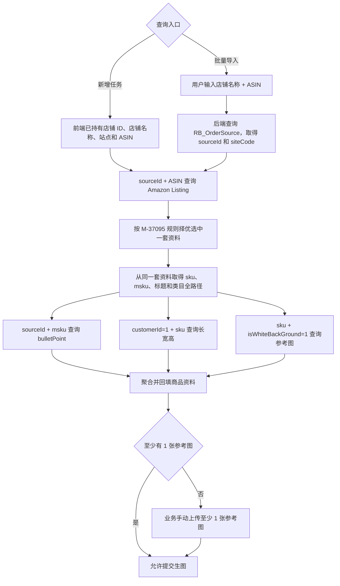

# 运营版店铺 ASIN 完整取数链路说明

GitHub 文档：

https://github.com/xuqiang97/ai-image-prd-hub/blob/main/prd/2026-08/M-37095-store-asin-product-selection/docs/store-asin-data-retrieval-flow.md

归属需求：M-37095【AI生图】[运营]店铺ASIN多套商品资料择优取数逻辑优化

父级正式 PRD：

https://github.com/xuqiang97/ai-image-prd-hub/blob/main/prd/2026-08/M-37095-store-asin-product-selection/README.md

文档定位：本文是 M-37095 的下级辅助文档，用于统一记录该需求生效后的运营版店铺 ASIN 最新完整取数链路，不构成独立需求，不单独维护禅道、PRD 版本、修改纪要或验收标准。M-37095 的正式改造范围和验收口径以父级 README.md 为准；如有冲突，以父级 README.md 为准。

## 1. 适用入口和边界

完整取数链路只适用于以下两个入口：

1. 运营版新增任务抽屉点击“查询”。
2. 运营版批量导入店铺 ASIN。

编辑任务不支持重新查询，店铺和 ASIN 均为置灰状态。编辑任务只使用创建或导入时已保存的商品资料，并允许业务按现有能力完善文本和参考图，不重新调用本文所列接口。

本文用于说明店铺、ASIN、Listing、亮点、尺寸和参考图之间的数据依赖与最终有效口径。除 M-37095 明确调整的多套资料筛选、排序和 MSKU/SKU 成对取值外，其他已存在的页面、任务保存和人工完善逻辑不因此全部视为本期新增开发范围。未来按图片类型和位置配置参考图的策略不在本文范围内。

## 2. 总体取数链路



Amazon Listing 择优完成后，亮点、尺寸和参考图只依赖已选资料中的 `sourceId + msku` 或 `sku`，不存在相互依赖关系。研发可结合现有架构并行调用这三个数据源，以降低实时查询耗时。

## 3. 新增任务单个查询

### 3.1 店铺上下文

打开新增任务抽屉时，前端调用现有 `GetOrderSourceTreeSelect` 获取当前用户可选择的店铺列表，已经取得店铺名称和店铺 ID 的对应关系。用户选择店铺后，前端直接持有对应的店铺 ID，无需在点击“查询”后根据店铺名称再次查询或转换店铺 ID。

点击“查询”时，前端调用现有后端查询接口 `listingV2ToAiImage`，当前请求对象位于 `input[]` 中，已包含：

```json
{
  "orderSourceId": "26342",
  "orderSourceName": "Amazon-Z011523-US",
  "siteCode": "US",
  "asin": "B0FD96XBG"
}
```

字段口径：

| 前端字段 | 含义 | 后续用途 |
|---|---|---|
| `orderSourceId` | 店铺 ID | 对应 Amazon Listing 内部接口的 `sourceId`；截图中的现有请求类型为字符串，后端按上游接口要求处理类型 |
| `orderSourceName` | 店铺名称 | 沿用现有任务上下文和展示 |
| `siteCode` | 站点 | 沿用现有任务上下文，不自行增加为本文所列内部接口的查询条件 |
| `asin` | ASIN | 与 `sourceId` 组合查询 Amazon Listing |

单个查询不得根据页面展示的店铺名称重新反查店铺 ID，也不得绕过现有店铺列表权限范围扩展查询。

## 4. 批量导入查询

### 4.1 输入和店铺映射

批量导入继续沿用现有输入方式：用户输入“店铺名称 + 空格 + ASIN”，每行一组，单次最多 50 行。前端不提供 `sourceId`，后端根据每行店铺名称查询 `RB_OrderSource` 表，取得对应的 `sourceId` 和 `siteCode`。

`RB_OrderSource` 已确认同时维护店铺名称、店铺 ID 和站点的对应关系。准确字段名、查询条件、账号或权限隔离条件及数据库实现沿用现有代码，由研发结合现状确认；不得根据店铺名称后缀自行解析 `siteCode`。

店铺名称无匹配、存在异常匹配或数据库查询失败时，沿用现有批量导入的单行失败处理，不得随机选择店铺记录，也不得影响其他行继续处理。

### 4.2 行间隔离

- 每个店铺名称 + ASIN 组合独立取得 `sourceId + siteCode`，再独立执行 Listing 择优和后续资料补齐。
- 某一行 Listing 无有效资料、店铺映射失败或后续可选字段缺失时，不得串用其他行的数据。
- 某一行处理失败不得阻断其他行；是否创建任务取决于该行是否满足本文列明的主链路条件。
- 某一行没有自动参考图时，仍可成功导入并形成待完善任务，后续由业务进入编辑任务手动上传参考图。

## 5. Amazon Listing 查询和多套资料择优

### 5.1 数据源

- 接口文档：http://showdoc.zhcxkj.com/web/#/88/5259
- 接口：`POST http://open-api.zhcxkj.com/open/list/amazon-listing-asin`
- 请求条件：`sourceId + ASIN`

接口文档用于解释字段含义；字段是否返回、实际层级、类型和值以真实响应为准。请求示例和仓库文档不得保留真实 Authorization、Token、Cookie 或其他密钥。

### 5.2 择优规则和结果门槛

接口返回一套或多套资料时，均按父级 M-37095 README 的正式规则处理（完整 GitHub URL 见本文开头）：

1. 先硬排除明确已删除或禁显资料。
2. 剩余资料依次按在线状态、完整性、新品属性、配送与备货、更新时间和接口原始顺序择优。
3. 从排序后的候选开始检查结果有效性；同一候选的 `sku` 或 `msku` 任一缺失、为 `null`、空字符串或纯空白时，继续降级检查下一套资料。
4. 最终结果必须从同一个候选对象取得 `sku + msku`，不得跨资料拼接。

硬排除条件、完整排序维度、未知值处理和验收案例以父级 README.md 为准，本文不维护第二套择优明细。

### 5.3 从选中资料取得字段

最终选中一套资料后，从同一个结果对象读取：

| 字段路径 | 用途 | 缺失处理 |
|---|---|---|
| `sku` | 系统 SKU；继续查询尺寸和参考图 | 与 `msku` 共同构成结果有效性门槛 |
| `msku` | 店铺商品 MSKU；继续查询五点描述 | 与 `sku` 共同构成结果有效性门槛 |
| `name` | Listing 标题 | 留空继续，不降级改选其他资料 |
| `classifications.namePath` | 亚马逊分类树名称全路径 | 留空继续，不降级改选其他资料 |

`classifications` 的实际响应为对象，`namePath` 为完整字符串。类目名称自身可能包含逗号，因此必须把整个 `namePath` 作为不可拆分的文本原样回填和保存，不按逗号拆分或重新拼接。

标题只取选中 Listing 资料的 `name`。后续亮点接口即使返回 `itemName`，也不得用其替换或补齐标题。

接口无数据、全部候选被硬排除，或所有剩余候选均无法同时提供有效 `sku + msku` 时，单个查询沿用现有失败处理；批量场景该行失败，其他行继续。

## 6. 五点描述

### 6.1 数据源和字段

- 接口文档：http://showdoc.zhcxkj.com/web/#/88/5569
- 接口：`POST http://open-api.zhcxkj.com/open/list/amazonListingItemAttrsList`
- 请求条件：`params[].sourceId + params[].msku`
- 响应关联：`data[].sourceId + data[].msku`
- 取值字段：`data[].bulletPoint`

实际响应中的 `bulletPoint` 为字符串数组。批量或多参数请求必须根据每个结果对象的 `sourceId + msku` 关联数据，不依赖请求和响应数组下标。

### 6.2 回填规则

- 直接使用 `bulletPoint` 返回的全部数组元素，不限制必须为 5 条。
- 保持接口原始顺序，每个数组元素单独一行，元素之间使用换行符连接。
- 不增加序号、圆点或其他前缀，不补齐、不截断。
- 少于 5 条时使用实际返回的全部条目；超过 5 条时仍使用全部条目。
- 空数组、`null`、无匹配数据或接口调用失败时，五点描述留空，继续后续链路。
- 不使用同一接口返回的 `itemName`、`productDesc`、`productImages`、`genericKeyword` 等字段替代或补齐五点描述。

### 6.3 商品文本总字数

标题、类目和全部五点描述均完整回填，系统沿用现有“商品文本信息总字数”上限 2500 字校验。自动回填后超过 2500 字时，不静默截断任何接口内容；业务手动删减至 2500 字以内后，方可提交生图。本期不新增计数、超限提示或其他页面交互。

批量导入某行自动回填后的商品文本信息总字数超过 2500 字时，该行仍成功导入并形成待完善任务，不影响其他行继续导入；业务后续进入编辑任务手动删减至 2500 字以内后，方可提交生图。

## 7. 商品尺寸

### 7.1 数据源和字段

- 接口文档：http://showdoc.zhcxkj.com/web/#/18/6870
- 接口：`POST http://erpapi.zhcxkj.com/Erp/Products/GetProductsV2`
- 请求条件：`input.customerId` 固定为数字 `1`，`input.skus[]` 传系统 SKU
- 响应关联：`data[].sku`
- 取值字段：匹配商品对象顶层的 `length`、`width`、`height`

三个尺寸字段实际为数值，单位始终为厘米（`CM`）。页面分别回填长、宽、高并显示固定单位 `CM`，无需进行单位判断或换算。

不得误取或使用以下字段替代：

- `packLength`、`packWidth`、`packHeight` 等包装尺寸；
- `cartonLength`、`cartonWidth`、`cartonHeight` 等箱规尺寸；
- `productSize` 拼接文本。

### 7.2 空值和失败处理

`length`、`width`、`height` 组成一套完整尺寸。任一字段为 `0`、`null`、缺失，或接口无匹配数据、调用失败时，尺寸整体留空，不保留不完整尺寸，也不使用其他尺寸字段补齐。尺寸缺失不阻断其他资料回填和生图链路。

## 8. 白底参考图

### 8.1 数据源和字段

- 接口文档：http://showdoc.zhcxkj.com/web/#/18/6963
- 接口：`POST http://erpapi.zhcxkj.com/Product/ProductImage/GetList`
- 请求条件：`isWhiteBackGround` 固定传数字 `1`，`skus[]` 传系统 SKU
- 响应关联：扁平结果 `data[].sku`
- 取值字段：`data[].imageUrl`

接口不会为无图 SKU 返回空占位对象。批量请求必须先按 `data[].sku` 分组，再按每个 SKU 在接口中的原始返回顺序独立取图，不依赖请求和响应数组下标。

### 8.2 有效图片和数量

对每个 SKU 的图片记录按原始返回顺序处理：

1. 读取 `imageUrl` 并去除首尾空格。
2. `imageUrl` 为 `null`、空字符串或纯空白时跳过。
3. 对处理后的完整 URL 精确去重，相同地址只保留第一次出现的位置。
4. 跳过空值和重复地址后继续向后收集，最多取得前 5 张不同图片。
5. 有效图片为 5 张及以下时全部取用；超过 5 张时只取前 5 张。

取数阶段只校验 `imageUrl` 非空，不逐张访问 URL 验证图片能否下载，避免额外增加单个查询和 50 行批量导入的耗时。图片读取异常沿用后续现有处理。

本期只使用 `imageUrl`，不改取 `cosImageUrl`，也不使用 `isCover`、`isSpareCover`、`isHand`、`isScene` 等其他字段增加筛选或排序条件。

### 8.3 无自动参考图

- 新增任务查询无有效图片或图片接口失败时，其他商品资料正常回填，自动参考图为空；业务在当前新增任务抽屉手动上传至少 1 张参考图后，方可提交生图。
- 批量某行无有效图片或图片接口失败时，该行仍可成功导入并形成待完善任务，不影响其他行；业务后续进入编辑任务手动上传至少 1 张参考图后，方可提交生图。
- 自动取得与人工上传的参考图合计须为 1～5 张；达到至少 1 张即可提交，不要求补足 5 张，也不得超过现有 5 张上限。

当前固定取白底图。未来“前三张取白底图、第 4 张取手持图、第 5 张取场景图”等按图片类型和位置配置的策略，应单独梳理和实施，不在本文范围内。

## 9. 主链路、可选数据和失败结果

| 环节或字段 | 成功口径 | 无数据或失败时的结果 | 是否阻断当前行 |
|---|---|---|---|
| 单个查询店铺上下文 | 前端请求已包含店铺 ID、店铺名称、站点和 ASIN | 沿用现有查询前校验 | 是 |
| 批量店铺映射 | 从 `RB_OrderSource` 取得 `sourceId + siteCode` | 沿用现有单行失败处理 | 是，仅阻断当前行 |
| Listing 和择优 | 选中同一套资料的有效 `sku + msku` | 无数据、全部硬排除或无有效结果时查询失败 | 是，仅阻断当前行 |
| 标题 `name` | 使用选中资料标题 | 留空继续，不改选其他资料 | 否 |
| 类目 `classifications.namePath` | 使用完整字符串 | 留空继续，不改选其他资料 | 否 |
| 五点描述 `bulletPoint` | 全部元素按原顺序逐行回填 | 留空继续 | 否 |
| 商品文本信息总字数 | 标题、类目和五点描述合计不超过 2500 字 | 完整回填且不静默截断；批量行仍导入为待完善任务 | 不阻断保存或导入，但提交生图前必须人工删减至 2500 字以内 |
| 商品尺寸 | 顶层长宽高均为有效非零值 | 尺寸整体留空继续 | 否 |
| 参考图 | 自动取得与人工上传合计 1～5 张；自动图片最多取 5 张非空、去重的 `imageUrl` | 自动参考图为空，允许保存或导入 | 不阻断保存或导入，但提交生图前必须人工补足至少 1 张，合计不得超过 5 张 |

批量场景中，每行按以上规则独立处理。任何一行的店铺、Listing、亮点、尺寸、图片或失败结果均不得被其他行复用为错误关联，也不得阻断其他行继续处理。

## 10. 数据关联和保存口径

- Listing 候选按 `sourceId + ASIN` 区分查询组合。
- 五点描述按 `sourceId + msku` 关联。
- 尺寸和参考图按 `sku` 关联。
- `sku`、`msku`、`name` 和 `classifications.namePath` 均从最终选中的同一个 Listing 结果对象读取。
- 数组或批量接口均使用以上稳定标识关联结果，不依赖外层数组下标。
- 查询或导入取得的数据沿用现有任务保存逻辑；上游数据后续变化不会自动修改已保存任务。
- 编辑任务不重新查询上游接口，只展示和保存任务当前数据，并允许业务按现有能力人工完善。

## 11. 接口聚合和性能评估（研发技术评估项）

本节仅记录研发技术评估方向，不构成 M-37095 新增的强制改造范围、技术方案或性能验收指标。本链路为实时查询，涉及店铺上下文、Listing、亮点、尺寸和图片多个数据源；页面继续通过一次查询取得完整结果，后端可结合现有实现评估扩展 `listingV2ToAiImage` 或新增聚合接口，不要求前端直接串行调用多个内部接口。

建议的依赖顺序为：

1. 先取得或接收 `sourceId + siteCode`。
2. 使用 `sourceId + ASIN` 查询 Listing，并完成 M-37095 择优。
3. 取得 `sku + msku` 后，并行查询亮点、尺寸和参考图。
4. 聚合各数据源结果，按单个查询或批量行返回。

各上游接口已经使用数组或列表型入参时，研发可结合接口能力在批量场景中去重、分组和批量调用，避免按每行逐接口串行请求。具体采用现有接口扩展还是新接口、并发数、超时、重试、缓存和性能数值由研发结合现有架构评估，本文不固化技术实现方案。

无论采用何种技术方案，已确认的业务结果保持不变：

- 新增任务与批量导入使用相同的 Listing 择优规则。
- 可选的亮点、尺寸或自动图片接口失败时返回可用的部分结果，不将整条主链路错误判定为失败。
- 批量行间数据和失败结果相互隔离。

日志定位、并发数、超时、重试、缓存及具体聚合方式均由研发结合现有架构评估；页面不新增未经确认的提示和交互。

## 12. 关联接口与资料

| 类型 | 地址或名称 | 本文用途 |
|---|---|---|
| 父级正式 PRD | https://github.com/xuqiang97/ai-image-prd-hub/blob/main/prd/2026-08/M-37095-store-asin-product-selection/README.md | 多套资料择优正式规则、范围和验收来源 |
| 最初需求文档 | [运营版 AI 生图初版需求文档 - 内部取数接口](https://www.yuque.com/johnny97pm/zhcx/saleaiimageprd?singleDoc#h2KRR) | 初版取数入口和历史事实参考 |
| 店铺列表接口 | `GetOrderSourceTreeSelect` | 新增任务抽屉加载店铺名称和店铺 ID 关系 |
| 现有 AI 生图查询接口 | `listingV2ToAiImage` | 新增任务前端查询入口；聚合方式由研发评估 |
| 店铺映射表 | `RB_OrderSource` | 批量场景按店铺名称取得 `sourceId + siteCode` |
| Amazon Listing 接口 | http://showdoc.zhcxkj.com/web/#/88/5259 | 查询 Listing 并按 M-37095 择优 |
| Listing 属性接口 | http://showdoc.zhcxkj.com/web/#/88/5569 | 按 `sourceId + msku` 查询 `bulletPoint` |
| 产品尺寸接口 | http://showdoc.zhcxkj.com/web/#/18/6870 | 按 SKU 查询顶层长宽高 |
| 产品图片接口 | http://showdoc.zhcxkj.com/web/#/18/6963 | 按 SKU 查询白底参考图 |

以上内网接口文档仅作为字段含义参考，实际字段层级、类型和值以接口真实响应为准；历史资料和截图只作为事实证据，不覆盖本文及父级 README.md 已明确的最终口径。
