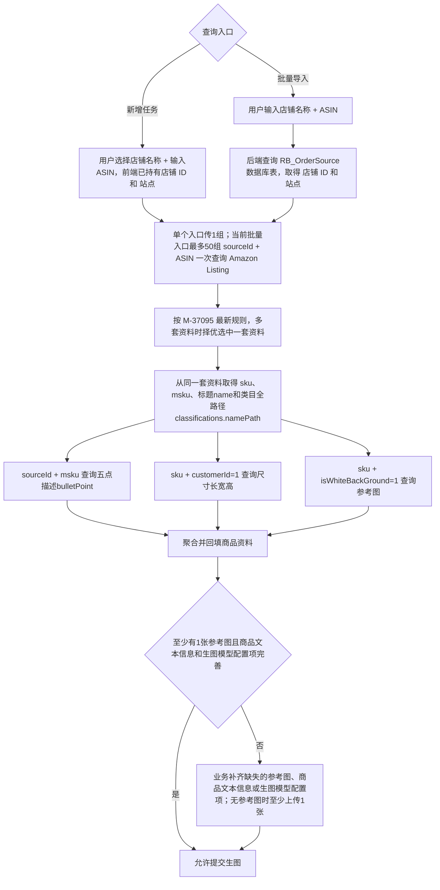

# 运营版店铺 ASIN 完整取数链路说明

GitHub 文档：

https://github.com/xuqiang97/ai-image-prd-hub/blob/main/prd/2026-08/M-37095-store-asin-product-selection/docs/store-asin-data-retrieval-flow.md

归属需求：[M-37095【AI生图】\[运营\]店铺ASIN多套商品资料择优取数逻辑优化](https://pm.zhcxkj.com/zentao/story-view-37095.html)

父级正式 PRD：

https://github.com/xuqiang97/ai-image-prd-hub/blob/main/prd/2026-08/M-37095-store-asin-product-selection/README.md

文档定位：本文是 M-37095 的下级辅助文档，用于统一记录该需求生效后的运营版店铺 ASIN 最新完整取数链路，不构成独立需求，不单独维护禅道、PRD 版本、修改纪要或验收标准。M-37095 的正式改造范围和验收口径以父级 README.md 为准；如有冲突，以父级 README.md 为准。

## 1. 适用入口和边界

完整取数链路只适用于以下两个入口：

1. 运营版新增任务抽屉点击“查询”。
2. 运营版批量导入店铺 ASIN。

编辑任务不支持重新查询，店铺和 ASIN 均为置灰状态。编辑任务只使用创建或导入时已保存的商品资料，并允许业务按现有能力完善商品文本信息、参考图和生图模型配置项，不重新调用本文所列接口。

本文用于说明店铺、ASIN、Listing、五点描述、尺寸和参考图之间的数据依赖与最终有效口径。M-37095 本期核心改造范围为多套资料筛选、排序、最终命中对象字段一致性和 MSKU/SKU 成对取值，并要求研发对照本文核对现状完整链路、修正影响业务结果的现状差异，同时完成第 11 节列明的批量性能技术评估和可行优化。本文记录的页面、任务保存、状态判断和人工完善规则本身属于现状基线；现状实现与已确认业务口径一致时，不因此重复开发或强制重构。未来按图片类型和位置配置参考图的能力仅作为技术设计预留，不属于 M-37095 本期实施和验收范围。

## 2. 总体取数链路



Amazon Listing 择优完成后，五点描述使用当前查询的 `sourceId` 和最终命中对象的 `msku` 查询，尺寸和参考图使用最终命中对象的 `sku` 查询，三者之间不存在相互依赖关系。研发可结合现有架构并行调用这三个数据源，以降低实时查询耗时。

### 2.1 现状字段数据源分工

以下为运营版现有字段数据源分工，用于说明完整取数链路。现状实现与以下业务口径一致时不重复开发；如存在影响业务结果的差异，按本文第 11 节要求在 M-37095 中一并对齐。运营版按字段的数据能力固定划分数据源，不对同一个字段在 Listing 与产品库之间执行自动降级、补齐或覆盖。

| 字段 | 固定数据源 | 取数原因 | 空值或失败处理 |
|---|---|---|---|
| 标题、类目 | Amazon Listing 取数接口最终选中的同一结果对象 | 标题为运营针对当地语言和渠道优化后的 Listing 文案，类目为亚马逊当地站点官方分类树路径；例如德国站使用德语资料，法国站使用法语资料 | 保持为空并由业务人工补齐；不改取产品库同类字段，也不为了补齐这些字段改选下一套 Listing 资料 |
| 五点描述 | Listing 大字段属性接口；使用当前查询的 `sourceId` 和最终命中对象的 `msku` 查询并关联 `bulletPoint` | 五点描述为运营针对当地语言和渠道优化后的 Listing 文案 | 保持为空并由业务人工补齐；不改取产品库同类字段，也不使用该接口其他字段替代或补齐 |
| 尺寸、参考图 | 产品库 | Listing 未保存尺寸和参考图，运营版只能使用最终选中 Listing 的 `sku` 查询产品库补齐 | 分别按本文第 7 节和第 8 节的空值、失败及人工完善规则处理 |

Listing 的 `classifications.namePath` 是亚马逊当地站点官方类目全路径，保留当地渠道语言和原始层级文本。例如：

- 日本站：`文房具・オフィス用品,カテゴリー別,筆記具,ペン,ボールペン,油性ボールペン`
- 德国站：`Auto & Motorrad,Kategorien,Ersatz-, Tuning- & Verschleißteile,Innenausstattung,Sitze, Sitzbänke & Zubehör,Zubehör`

产品库类目可能是中英文括号混合的内部分类路径，例如 `Toys & Games(玩具和游戏)>>Novelty & Gag Toys(创意玩具)>>Money Banks(存钱罐)`，不得用于替代或补齐运营版的 Listing 类目。

因此，产品库即使存在标题、类目或五点描述等同类字段，运营版也不读取这些字段作为 Listing 文案的兜底；Listing 标题、类目或五点描述为空时，继续沿用已选资料并由业务人工完善。

## 3. 单个新增与编辑抽屉

### 3.1 新增任务店铺上下文

打开新增任务抽屉时，前端调用现有 `GetOrderSourceTreeSelect` 获取当前用户可选择的店铺列表，已经取得店铺名称和店铺 ID 的对应关系。用户选择店铺后，前端直接持有对应的店铺 ID，无需在点击“查询”后根据店铺名称再次查询或转换店铺 ID。

点击“查询”时，前端调用现有后端查询接口 `listingV2ToAiImage`，当前请求对象位于 `input[]` 中，已包含：

```json
{
  "orderSourceId": "26342",
  "orderSourceName": "Amazon-Z011523-US",
  "siteCode": "US",
  "asin": "B0FD96XBG"
}
```

字段口径：

| 前端字段 | 含义 | 后续用途 |
|---|---|---|
| `orderSourceId` | 店铺 ID | 对应 Amazon Listing 内部接口的 `sourceId`；截图中的现有请求类型为字符串，后端按上游接口要求处理类型 |
| `orderSourceName` | 店铺名称 | 沿用现有任务上下文和展示 |
| `siteCode` | 站点 | 沿用现有任务上下文，不自行增加为本文所列内部接口的查询条件 |
| `asin` | ASIN | 与 `sourceId` 组合查询 Amazon Listing |

单个查询不得根据页面展示的店铺名称重新反查店铺 ID，也不得绕过现有店铺列表权限范围扩展查询。

### 3.2 现状保存校验与状态

以下为单个新增和编辑抽屉的现状保存规则。现状实现与以下业务口径一致时不重复开发；如存在影响业务结果的差异，按本文第 11 节要求在 M-37095 中一并对齐。单个新增任务查询只负责自动回填接口可取得的数据。新增任务抽屉和编辑任务抽屉在保存时，商品文本信息、参考图和生图模型配置项均按现有必填规则校验：

- 商品文本信息中的标题、类目、尺寸和五点描述均已完善；长、宽、高三个尺寸字段均为有效非零值。
- 标题、类目和全部五点描述合计不超过 2500 字。
- 自动取得与人工上传的参考图合计为 1～5 张。
- 生图模型配置项已按现有规则完善。

任一项未满足时，单个新增或编辑抽屉均不允许保存，也不允许提交生图，业务须在当前抽屉补齐或修正后再操作。单个新增和编辑抽屉不会保存出“待完善”任务；符合全部保存条件并选择保存为待提交时，任务状态为“待提交”。

## 4. 批量导入查询

### 4.1 输入和店铺映射

批量导入继续沿用现有输入方式：用户输入“店铺名称 + 空格 + ASIN”，每行一组，单次最多 50 行。前端不提供 `sourceId`，后端根据每行店铺名称查询 `RB_OrderSource` 表，取得对应的 `sourceId` 和 `siteCode`。

`RB_OrderSource` 已确认同时维护店铺名称、店铺 ID 和站点的对应关系。准确字段名、查询条件、账号或权限隔离条件及数据库实现沿用现有代码，由研发结合现状确认；不得根据店铺名称后缀自行解析 `siteCode`。

店铺名称无匹配、存在异常匹配或数据库查询失败时，沿用现有批量导入的单行失败处理，不得随机选择店铺记录，也不得影响其他行继续处理。

### 4.2 行间隔离

- 每个店铺名称 + ASIN 组合独立取得 `sourceId + siteCode`，再独立执行 Listing 择优和后续资料补齐。
- 同一批次经店铺映射后，`sourceId + ASIN` 完全相同的重复输入只保留一条，只处理一次并最多创建一个任务。
- 某一行 Listing 无有效资料、店铺映射失败或后续可选字段缺失时，不得串用其他行的数据。
- 某一行处理失败不得阻断其他行；是否创建任务取决于该行是否满足本文列明的主链路条件。
- 某一行满足店铺映射和 Listing 有效 `sku + msku` 等主链路条件后，即可成功导入并创建任务。商品文本信息、参考图或生图模型配置项任一未完善时，该行形成“待完善”任务；业务后续进入编辑任务补齐全部必填项并保存后，任务转为“待提交”。

## 5. Amazon Listing 查询和多套资料择优

### 5.1 数据源

- 接口文档：http://showdoc.zhcxkj.com/web/#/88/5259
- 接口：`POST http://open-api.zhcxkj.com/open/list/amazon-listing-asin`
- 请求结构：顶层数组 `[{sourceId, asin}, ...]`；单个查询传 1 组，批量导入传去重后的最多 50 组 `sourceId + ASIN`
- 响应关联：扁平候选列表中每条结果对象的 `sourceId + asin`

接口文档用于解释字段含义；字段是否返回、实际层级、类型和值以真实响应为准。请求示例和仓库文档不得保留真实 Authorization、Token、Cookie 或其他密钥。

实际调用已确认该接口单批最多支持 50 组 `sourceId + ASIN`：在接口正常响应的边界验证中，50 组查询成功，51 组返回 HTTP 200，但业务字段 `success = false`、错误码 `10000500`，错误信息明确提示每次最大请求数为 50。当前批量导入最多 50 行，去重后使用一次 Listing 批量调用，不拆成多个瞬时并发请求。实现仍须保留按单批不超过 50 组进行顺序分片和稳定键聚合的能力，不得把当前单批方式写成后续无法扩展的固定实现。批量结果不得依赖请求和响应顺序；系统须先按结果对象内的 `sourceId + asin` 分组，再对每组独立执行 M-37095 择优。批量中的某个请求组合无数据时，接口整体仍可成功，但不会为该组合返回空占位对象；系统须通过请求键与响应键的差集识别无数据行，不得将相邻组合的数据错误关联到该行。

### 5.2 择优规则和结果门槛

单个查询返回一套或多套资料，或批量查询按 `sourceId + asin` 分组后每组返回一套或多套资料时，均按父级 M-37095 README 的正式规则处理（完整 GitHub URL 见本文开头）：

1. 先硬排除明确已删除或禁显资料。
2. 剩余资料依次按在线状态、完整性、新品属性、配送与备货、更新时间和接口原始顺序择优。
3. 从排序后的候选开始检查结果有效性；同一候选的 `sku` 或 `msku` 任一缺失、为 `null`、空字符串或纯空白时，继续降级检查下一套资料。
4. `sku`、`msku`、`name` 和 `classifications.namePath` 必须从最终命中的同一个候选对象读取，不得跨资料拼接；其中只有 `sku + msku` 构成结果有效性门槛。

硬排除条件、完整排序维度、未知值处理和验收案例以父级 README.md 为准，本文不维护第二套择优明细。

### 5.3 从选中资料取得字段

最终选中一套资料后，从同一个结果对象读取：

| 字段路径 | 用途 | 缺失处理 |
|---|---|---|
| `sku` | 系统 SKU；继续查询尺寸和参考图 | 与 `msku` 共同构成结果有效性门槛 |
| `msku` | 店铺商品 MSKU；继续查询五点描述 | 与 `sku` 共同构成结果有效性门槛 |
| `name` | Listing 标题 | 留空继续，不降级改选其他资料；单个抽屉须人工补齐后才可保存，批量任务进入待完善 |
| `classifications.namePath` | 亚马逊分类树名称全路径 | 留空继续，不降级改选其他资料；单个抽屉须人工补齐后才可保存，批量任务进入待完善 |

`classifications` 的实际响应为对象，`namePath` 为完整字符串。类目名称自身可能包含逗号，因此必须把整个 `namePath` 作为不可拆分的文本原样回填和保存，不按逗号拆分或重新拼接。

标题只取选中 Listing 资料的 `name`。后续五点描述接口即使返回 `itemName`，也不得用其替换或补齐标题。

接口无数据、全部候选被硬排除，或所有剩余候选均无法同时提供有效 `sku + msku` 时，单个查询沿用现有失败处理；批量场景该行失败，其他行继续。

## 6. 五点描述

### 6.1 数据源和字段

- 接口文档：http://showdoc.zhcxkj.com/web/#/88/5569
- 接口：`POST http://open-api.zhcxkj.com/open/list/amazonListingItemAttrsList`
- 请求条件：`params[].sourceId + params[].msku`；接口单批最多 100 组，当前最多 50 行的批量导入实际最多传 50 组
- 响应关联：`data[].sourceId + data[].msku`
- 取值字段：`data[].bulletPoint`

实际响应中的 `bulletPoint` 为字符串数组。接口已实测单批最多支持 100 组 `sourceId + msku`：在接口正常响应的边界验证中，100 组查询成功，101 组返回 HTTP 200，但业务字段 `success = false`、错误码 `10000000`，错误信息明确提示单次最大查询 100 条。当前批量导入最多为 50 行，每行只使用最终选中的 1 组 `sourceId + msku`，因此使用一次五点描述批量调用。未来扩量时仍按该接口自身 100 组上限独立设计，不照搬 Listing 的 50 组分片；超过上限且无法推动接口扩容时逐批顺序调用。批量响应顺序不保证与请求顺序一致，无匹配数据的请求项不会返回空占位对象。系统必须根据每个结果对象的 `sourceId + msku` 关联数据，并通过请求键与响应键的差集识别无匹配项，不依赖请求和响应数组下标。

### 6.2 回填规则

- 直接使用 `bulletPoint` 返回的全部数组元素，不限制必须为 5 条。
- 保持接口原始顺序，每个数组元素单独一行，元素之间使用换行符连接。
- 不增加序号、圆点或其他前缀，不补齐、不截断。
- 少于 5 条时使用实际返回的全部条目；超过 5 条时仍使用全部条目。
- 空数组、`null`、无匹配数据或接口调用失败时，五点描述留空并继续其他资料回填，不改用其他接口字段补齐；单个抽屉须人工补齐后才可保存，批量任务进入待完善。
- 不使用同一接口返回的 `itemName`、`productDesc`、`productImages`、`genericKeyword` 等字段替代或补齐五点描述。

### 6.3 商品文本总字数

标题、类目和全部五点描述均完整回填，系统沿用现有“商品文本信息总字数”上限 2500 字校验。自动回填后超过 2500 字时，不静默截断任何接口内容。本期不新增计数、超限提示或其他页面交互。

单个新增或编辑抽屉中，业务须手动删减至 2500 字以内后才可保存或提交生图。

批量导入某行自动回填后的商品文本信息总字数超过 2500 字时，该行仍成功导入并形成待完善任务，不影响其他行继续导入；业务后续进入编辑任务手动删减至 2500 字以内，并补齐或修正其他全部必填项后保存，任务转为待提交，方可提交生图。

## 7. 商品尺寸

### 7.1 数据源和字段

- 接口文档：http://showdoc.zhcxkj.com/web/#/18/6870
- 接口：`POST http://erpapi.zhcxkj.com/Erp/Products/GetProductsV2`
- 请求条件：`input.customerId` 固定为数字 `1`，`input.skus[]` 传系统 SKU；接口单批最多 500 个 SKU，当前最多 50 行的批量导入实际最多传 50 个去重 SKU
- 响应关联：`data[].sku`
- 取值字段：匹配商品对象顶层的 `length`、`width`、`height`

三个尺寸长宽高字段实际为数值，单位始终为厘米（`CM`）。页面分别回填长、宽、高并显示固定单位 `CM`，无需进行单位判断或换算。

不得误取或使用以下字段替代：

- `packLength`、`packWidth`、`packHeight` 等包装尺寸；
- `cartonLength`、`cartonWidth`、`cartonHeight` 等箱规尺寸；
- `productSize` 拼接文本。

### 7.2 空值和失败处理

`length`、`width`、`height` 组成一套完整尺寸。任一字段为 `0`、`null`、缺失，或接口无匹配数据、调用失败时，尺寸整体留空，不保留不完整尺寸，也不使用其他尺寸字段补齐。尺寸缺失不阻断其他资料回填；单个抽屉须人工补齐完整尺寸后才可保存，批量任务进入待完善。

## 8. 白底参考图

### 8.1 数据源和字段

- 接口文档：http://showdoc.zhcxkj.com/web/#/18/6963
- 接口：`POST http://erpapi.zhcxkj.com/Product/ProductImage/GetList`
- 请求条件：`isWhiteBackGround` 固定传数字 `1`，`skus[]` 传系统 SKU；接口单批最多 100 个 SKU，当前最多 50 行的批量导入实际最多传 50 个去重 SKU
- 响应关联：扁平结果 `data[].sku`
- 取值字段：`data[].imageUrl`

接口不会为无图 SKU 返回空占位对象。批量请求必须先按 `data[].sku` 分组，再按每个 SKU 在接口中的原始返回顺序独立取图，不依赖请求和响应数组下标。

### 8.2 有效图片和数量

对每个 SKU 的图片记录按原始返回顺序处理：

1. 读取 `imageUrl` 并去除首尾空格。
2. `imageUrl` 为 `null`、空字符串或纯空白时跳过。
3. 对处理后的完整 URL 精确去重，相同地址只保留第一次出现的位置。
4. 跳过空值和重复地址后继续向后收集，最多取得前 5 张不同图片。
5. 有效图片为 5 张及以下时全部取用；超过 5 张时只取前 5 张。

取数阶段只校验 `imageUrl` 非空，不逐张访问 URL 验证图片能否下载，避免额外增加单个查询和 50 行批量导入的耗时。图片读取异常沿用后续现有处理。

本期只使用 `imageUrl`，不改取 `cosImageUrl`，也不使用 `isCover`、`isSpareCover`、`isHand`、`isScene` 等其他字段增加筛选或排序条件。

### 8.3 无自动参考图

- 新增任务查询无有效图片或图片接口失败时，其他商品资料正常回填，自动参考图为空；业务须在当前新增任务抽屉手动上传至少 1 张参考图后，才可保存或提交生图。
- 批量某行无有效图片或图片接口失败时，该行仍可成功导入并形成待完善任务，不影响其他行；业务后续进入编辑任务手动上传至少 1 张参考图，并补齐其他必填项后，任务转为待提交。
- 单个新增或编辑抽屉保存、提交生图，以及批量待完善任务转为待提交前，自动取得与人工上传的参考图合计须为 1～5 张；不要求补足 5 张，也不得超过现有 5 张上限。批量导入创建待完善任务时允许暂时无参考图。

当前固定传 `sku + isWhiteBackGround = 1` 取白底图，并按本文规则最多取得 5 张。以下为后续美工版和运营版共用的规划方向，仅用于当前技术设计预留，不属于 M-37095 实施和验收范围：

- 支持“3 张白底图 + 1 张场景图 + 1 张手持图”等按图片类型和位置组合配置的自动取图策略。
- 计划只传 SKU 实时查询产品图片接口，再根据接口实际返回的图片属性类型字段进行分类和取图；具体请求条件、属性字段、分类优先级及数量配置以后续独立需求确认结果为准。
- 后续单独设计业务便捷取图弹窗。业务点击“选图”后，系统按当前 SKU 实时查询产品图片接口，并根据返回的图片属性类型分类展示，供业务选择。

研发设计当前产品图片查询和聚合逻辑时，须将“接口查询”“图片属性分类”“图片类型及位置选择策略”解耦考虑，不把当前固定白底图规则固化为美工版、运营版永久共用规则；本期不要求修改现有接口入参、返回结构、参考图数量规则或页面交互，也不提前实现上述未来能力。

## 9. 主链路、任务完整性和失败结果

### 9.1 主链路与取数结果

| 环节或字段 | 成功口径 | 无数据或失败时的结果 | 对当前入口的影响 |
|---|---|---|---|
| 单个查询店铺上下文 | 前端请求已包含店铺 ID、店铺名称、站点和 ASIN | 沿用现有查询前校验 | 单个查询失败，不进入资料回填 |
| 批量店铺映射 | 从 `RB_OrderSource` 取得 `sourceId + siteCode` | 沿用现有单行失败处理 | 当前行导入失败且不创建任务，其他行不受影响 |
| Listing 和择优 | 选中同一套资料的有效 `sku + msku` | 无数据、全部硬排除或无有效结果时查询失败 | 单个查询失败；批量当前行导入失败且不创建任务，其他行不受影响 |
| 标题 `name` | 使用选中资料标题 | 留空继续其他资料回填，不改选其他资料 | 单个抽屉阻断保存；批量行导入为待完善 |
| 类目 `classifications.namePath` | 使用完整字符串 | 留空继续其他资料回填，不改选其他资料 | 单个抽屉阻断保存；批量行导入为待完善 |
| 五点描述 `bulletPoint` | 全部元素按原顺序逐行回填 | 留空继续其他资料回填 | 单个抽屉阻断保存；批量行导入为待完善 |
| 商品文本信息总字数 | 标题、类目和五点描述合计不超过 2500 字 | 完整回填且不静默截断 | 单个抽屉阻断保存；批量行导入为待完善 |
| 商品尺寸 | 顶层长宽高均为有效非零值 | 尺寸整体留空，继续其他资料回填 | 单个抽屉阻断保存；批量行导入为待完善 |
| 参考图 | 自动取得与人工上传合计 1～5 张；自动图片最多取 5 张非空、去重的 `imageUrl` | 自动参考图为空，继续处理其他资料 | 单个抽屉阻断保存；批量行导入为待完善 |

批量场景中，每行按以上规则独立处理。任何一行的店铺、Listing、五点描述、尺寸、图片或失败结果均不得被其他行复用为错误关联，也不得阻断其他行继续处理。

### 9.2 单个新增和编辑抽屉现状规则

单个新增和编辑抽屉没有“先保存为待完善”的路径。保存时必须同时满足：商品文本信息中的标题、类目、尺寸和五点描述均已完善，标题、类目和全部五点描述合计不超过 2500 字，参考图合计为 1～5 张，且生图模型配置项已按现有规则完善。

本文所称商品文本信息完善，是指标题、类目和五点描述均通过现有必填校验，且长、宽、高三个尺寸字段均为有效非零值；五点描述使用接口实际返回或人工录入的内容，不要求必须恰好 5 条。

任一条件未满足时，沿用现有必填或校验提示，当前抽屉不允许保存，也不允许提交生图；全部满足后，才可保存为待提交或直接提交生图。

### 9.3 批量导入任务现状规则

批量导入某行完成店铺映射，并从 Listing 选中同一套有效 `sku + msku` 后，即满足创建任务的主链路条件。创建后的状态按以下规则判断：

- 待提交：至少有 1 张且不超过 5 张参考图；商品文本信息中的标题、类目、尺寸和五点描述均已完善；标题、类目和全部五点描述合计不超过 2500 字；生图模型配置项已按现有规则完善。
- 待完善：上述任一条件未满足。该行仍成功导入并创建任务，不影响其他行；业务进入编辑任务补齐或修正全部必填项并保存后，任务转为待提交。

店铺映射失败、Listing 无数据、全部候选被硬排除，或所有剩余候选均无法提供同一套有效 `sku + msku` 时，该行导入失败，不创建待完善任务。

## 10. 数据关联和保存口径

- Listing 候选按结果对象的 `sourceId + asin` 区分查询组合，对应业务输入的店铺 ID + ASIN。
- 五点描述按 `sourceId + msku` 关联。
- 尺寸和参考图按 `sku` 关联。
- `sku`、`msku`、`name` 和 `classifications.namePath` 均从最终选中的同一个 Listing 结果对象读取。
- 数组或批量接口均使用以上稳定标识关联结果，不依赖外层数组下标；接口未为无数据项返回空占位对象时，通过请求键与响应键的差集识别对应无返回项。
- 查询或导入取得的数据沿用现有任务保存逻辑；上游数据后续变化不会自动修改已保存任务。
- 编辑任务不重新查询上游接口，只展示和保存任务当前数据，并允许业务按现有能力人工完善。

## 11. 完整链路核对、接口聚合和批量性能优化

研发实施 M-37095 前须对照本文逐项核对当前两个入口的完整取数链路。若现状代码在字段数据源、字段层级、稳定关联键、空值与失败处理、单个与批量结果或任务状态方面，与本文已确认的业务口径不一致，本期一并调整至一致；现状技术结构不同但业务结果一致时，不为统一代码形式而强制重构。

本链路为实时查询，批量导入单次最多 50 行，涉及店铺上下文、Listing、五点描述、尺寸和图片多个数据源。研发须核对当前是否存在可避免的逐行串行调用，并完成本期可行的调用链优化。页面继续通过一次查询取得聚合结果，后端可结合现有实现扩展 `listingV2ToAiImage` 或新增聚合接口，不要求前端直接串行调用多个内部接口。

建议的依赖顺序为：

1. 先取得或接收 `sourceId + siteCode`。
2. 单个入口使用 1 组 `sourceId + ASIN` 查询 Listing；当前批量入口将去重后的最多 50 组 `sourceId + ASIN` 一次查询 Listing，按稳定键分组并分别完成 M-37095 择优。
3. 取得 `sku + msku` 后，并行查询五点描述、尺寸和参考图。
4. 聚合各数据源结果，按单个查询或批量行返回。

批量场景优先评估并实施以下可行优化：

- 店铺名称集中查询 `RB_OrderSource`，避免逐行重复查询数据库。
- 同一批次中完全相同的 `sourceId + ASIN` 输入先去重，只保留一条处理记录并最多创建一个任务；其查询结果在本批次内只计算一次。
- Listing 接口将当前去重后的最多 50 组 `sourceId + ASIN` 一次调用，不逐行请求，也不拆成多个瞬时并发请求。
- Listing 批量返回的扁平候选按 `sourceId + asin` 分组；某组无返回对象时，通过请求键与响应键的差集识别该行无数据，不依赖空占位对象，也不得影响其他组继续处理。
- 五点描述、尺寸和图片接口存在对应有效查询参数时，分别将当前去重后的有效参数合并为最多一次批量调用；没有有效查询参数时不发起空请求。未来扩量时优先推动对应接口扩容；无法扩容且超过该接口上限时，按自身上限独立顺序分片，不照搬 Listing 的分片大小。
- 所有批量结果仍按本文列明的稳定标识关联，不依赖请求和响应数组下标。
- 产品图片聚合保留查询与图片类型选择策略的解耦边界，当前继续执行固定白底图规则，不提前实现第 8.3 节列明的未来取图和弹窗能力。

Listing 单批上限固定为 50 组，五点描述单批上限固定为 100 组，GetProductsV2 商品信息接口单批上限固定为 500 个 SKU，ProductImage/GetList 图片接口单批上限固定为 100 个 SKU。当前最多 50 行时，存在对应有效查询参数的接口最多各使用一次批量调用；没有有效下游查询参数时不发起空请求。调度实现不得写成后续无法扩展的固定单批：未来扩量超过任一接口上限时，优先推动接口负责人扩容；无法扩容时，按对应接口自身上限独立分片并逐批顺序调用。所有分片均通过稳定键聚合，不能依赖数组下标。

同一接口的分片默认最大并发数为 1。只有接口负责人明确确认并发承载能力，且研发在目标环境完成专项容量验证后，才可另行评估受控并发；不得在未经确认和验证时启用瞬时并发，也不得在失败后立即无限重试。本期不新增业务重试、跨数据源降级或其他改变第 5.3 节及第 9 节既定失败边界的兜底机制；若现有底层网络调用已有瞬时重试，须保持查询条件、数据源、单行失败隔离和最终结果不变，不得将单批失败扩大为整批错误。实时业务口径未确认可接受的数据延迟前，不得擅自增加跨请求缓存；若受上游限制存在本期无法落地的优化项，研发须明确限制原因和后续建议。

联调完成后，研发须保留批量链路技术核对记录。记录同时包括各接口实际分片大小、批次数、同一接口并发数、HTTP 与业务成功状态、优化前后批量总耗时，以及本期无法落地的优化项和限制原因。当前同一接口并发数应为 1，本期不预设固定耗时指标。

无论采用何种技术方案，已确认的业务结果保持不变：

- 新增任务与批量导入使用相同的 Listing 择优规则。
- 五点描述、尺寸或自动图片等非 Listing 主链路的资料补充接口失败时，仍返回其他可用结果，不将整条 Listing 主链路错误判定为失败；单个抽屉和批量任务分别按本文已确认的现状完整性规则处理。
- 批量行间数据和失败结果相互隔离。
- 批量店铺映射、去重、并发和结果聚合均沿用现有账号和店铺权限范围，不得扩大权限或串用其他账号、其他店铺的数据。

日志定位、接口间并行度、超时及具体聚合方式均由研发结合现有架构评估；本期重试和缓存边界按本节前述规则执行，页面不新增未经确认的提示和交互。

## 12. 关联接口与资料

| 类型 | 地址或名称 | 本文用途 |
|---|---|---|
| 父级正式 PRD | https://github.com/xuqiang97/ai-image-prd-hub/blob/main/prd/2026-08/M-37095-store-asin-product-selection/README.md | 多套资料择优正式规则、范围和验收来源 |
| 最初需求文档 | [运营版 AI 生图初版需求文档 - 内部取数接口](https://www.yuque.com/johnny97pm/zhcx/saleaiimageprd?singleDoc#h2KRR) | 初版取数入口和历史事实参考 |
| 店铺列表接口 | `GetOrderSourceTreeSelect` | 新增任务抽屉加载店铺名称和店铺 ID 关系 |
| 现有 AI 生图查询接口 | `listingV2ToAiImage` | 新增任务前端查询入口；聚合方式由研发评估 |
| 店铺映射表 | `RB_OrderSource` | 批量场景按店铺名称取得 `sourceId + siteCode` |
| Amazon Listing 取数接口 | http://showdoc.zhcxkj.com/web/#/88/5259 | 单个入口传 1 组；当前批量入口传去重后的最多 50 组 `sourceId + ASIN` 一次查询并按 M-37095 择优 |
| Listing 大字段属性接口 | http://showdoc.zhcxkj.com/web/#/88/5569 | 按最终选中并去重后的最多 50 组 `sourceId + msku` 一次查询 `bulletPoint`；接口单批上限为 100 组 |
| 产品尺寸接口 | http://showdoc.zhcxkj.com/web/#/18/6870 | 按有效 SKU 查询顶层长宽高；单批最多 500 个 SKU，当前存在最多 50 个有效 SKU 时最多一次调用 |
| 产品图片接口 | http://showdoc.zhcxkj.com/web/#/18/6963 | 按有效 SKU 查询白底参考图；单批最多 100 个 SKU，当前存在最多 50 个有效 SKU 时最多一次调用 |

以上内网接口文档仅作为字段含义参考，实际字段层级、类型和值以接口真实响应为准；历史资料和截图只作为事实证据，不覆盖本文及父级 README.md 已明确的最终口径。
