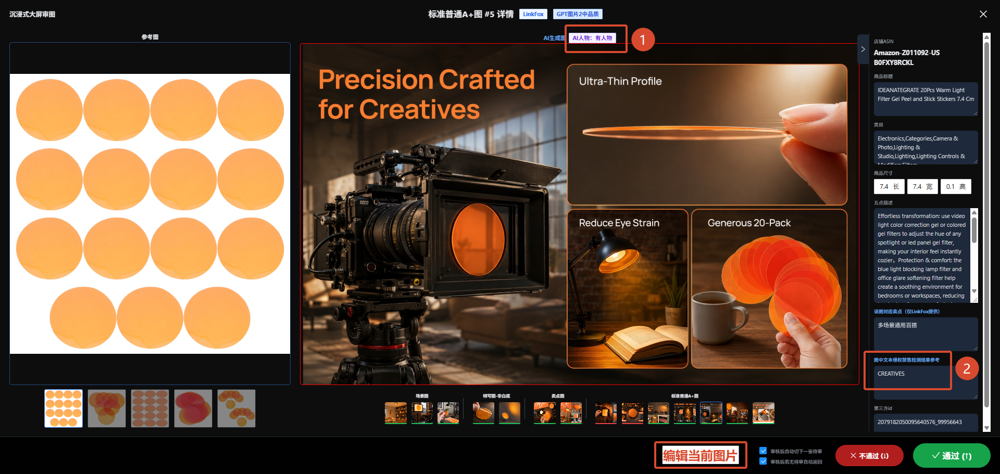
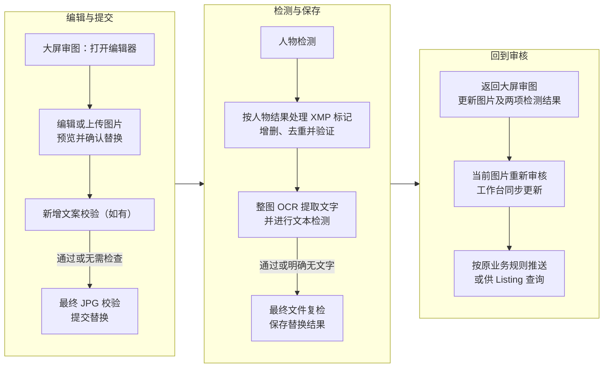

# M-37218【AI生图】[美工+运营]图片二改能力构建（责任人：徐强）

禅道需求：https://pm.zhcxkj.com/zentao/story-view-37218.html

GitHub PRD：https://github.com/xuqiang97/ai-image-prd-hub/blob/main/prd/2026-09/M-37218-image-secondary-editing/README.md

## 修改纪要

| 日期 | 版本 | 修改人 | 主要修改点 |
|---|---|---|---|
| 2026-09-07 | V1.0 | 徐强 | 支持审图清理违禁文字和图形，或上传外部修复图片回到原任务替换并审核；明确研发分工、文件与检测规则、替换记录、审核推送、消除统计及验收，操作细节引用源码。 |

## 编辑器源码与在线演示

编辑器源码仓库：https://github.com/ziziran97/pixelweave-studio

查看代码、已确认操作和接入说明；正式接入版本见第 7 节。

编辑器在线前端演示：https://ziziran97.github.io/pixelweave-studio/

体验已确认交互；仅供演示，不保存到业务任务。

## 需求概述



入口示意：底部为“编辑当前图片”入口，①为人物检测结果，②为图中文本侵权禁售检测结果参考；替换成功后，当前图片及两项检测结果同步更新。

查看原图：https://github.com/xuqiang97/ai-image-prd-hub/blob/main/prd/2026-09/M-37218-image-secondary-editing/assets/edit-entry.png

本期覆盖美工商品图、美工 A+ 图、运营商品图和运营 A+ 图，由任务创建人在可编辑阶段对已有业务图片记录且有可用成图的图片进行二改。

- 入口：从 Tab3「待审核」进入审核工作台，再进入沉浸式大屏审图；仅在大屏审图底部增加“编辑当前图片”，以全屏弹窗打开编辑器。
- 使用方式：支持在线编辑、上传本地 JPG/PNG 直接替换，以及上传后继续编辑；PNG 按原尺寸转白底 JPG。均在用户预览确认后统一检测、保存，上传本身只载入草稿。
- 生效结果：成功后返回大屏审图原图片位置，更新图片、人物检测结果和图中文字检测结果；仅当前图片回到待审核，其他图片审核结果保留，工作台卡片和审核数量同步。重新审核后按原业务规则推送或供 Listing 查询。
- 配套交付：保留原图及历次成功替换记录，接通消除使用统计，并落实同次提交去重、多窗口替换、旧图审核及推送确认后的编辑截止保护。

本期不增加完全生成失败图片的补录入口。后续跨系统接入预留可扩展的接入方式、来源信息及统一替换能力；本期不开发外部查询选图、外部系统的图片推送接入、候选管理或素材平台。一键消除图中文字、算法图层分离及指令改图留待后续需求。

## 研发流程与职责总览

编辑器已提供工具、上传校验、成图预览、问题定位、提交状态及消除事件采集，前端功能与交互已基本定稿，本期接入须完整保留。人物检测、XMP 打标及“阿里大模型 OCR → 公司内部文本违禁检测”复用现有能力；真实消除、替换检测与保存、审核回流及集中统计仍须接入和联调。

| 角色 | 本期需要交付的结果 | 重点阅读 |
|---|---|---|
| 前端研发（ERP 接入） | 在大屏审图全屏承载编辑器，接入业务身份、当前图及生效基准；传递上传原文件，接通消除和检测保存接口，完成新增文案批量检测与图层映射，按人物检测、XMP 处理、OCR 的顺序接通真实进度回报；落实异常查询、跨页面跟踪和关闭保护；替换后同步大屏图片及两项检测结果、工作台卡片和审核数量；发送消除事件，交付正式构建及更新/回退方式。 | 先看第 1、7 节接入，第 3～5 节状态与回流；文件和事件分别见第 2、6 节。 |
| 后端研发 | 校验权限与文件，转发消除请求；按两端上下文完成新增文案校验并返回图层对应结果，依流程串联人物检测、XMP 处理验证、整图 OCR/文本检测及保存；保留原图及替换记录，统一更新当前图、检测结果及待审核状态；提供同次提交去重与结果查询，校验多窗口替换、审核版本及推送确认后的编辑权限；对齐下游当前图取用，接收并汇总消除事件。 | 先看第 3～5 节检测、保存及下游；文件、统计和交付见第 2、6、7 节。 |
| 算法研发 | 对齐真实消除接口、限制、失败回执及实际版本/耗时信息，完成业务修图质量验收；配合人物检测业务样图验证及误检、漏检排查。 | 消除见第 2 节及源码接口说明；人物检测见第 3 节，统计口径见第 6 节。 |
| 测试 | 在两端实际 ERP 入口验证编辑、检测保存、审核及下游完整链路，核对真实接口、保存记录、最终文件及统计结果；编辑器操作细项按交付版本的专项检查项回归。 | 先看本节流程与覆盖概览，再按文末 10 个场景验收；交付条件见第 7 节。 |



图中仅展示替换成功主线，前后端文件校验、检测顺序、失败处理及结果未知查询见第 3 节。取消推送后的继续编辑、返回列表确认、编辑截止及下游规则见第 5 节。

### 测试覆盖概览

以下维度用于组织整体用例，按实际适用链路覆盖；具体通过标准统一见文末 10 个验收场景。

| 覆盖维度 | 重点 |
|---|---|
| 编辑路径 | 在线编辑、上传直接替换、上传后继续编辑，以及成功替换后再次打开编辑。 |
| 业务差异 | 文本检测中，美工仅传检测文本，运营另带所属任务的平台、站点及类目参数（第 3 节）。四条链路均在“确认推送？”二次确认后进入自动推送流程并禁止二改；运营商品图跳过实际图片推送，由 Listing 管理查询取图（第 5 节）。 |
| 关键结果 | 成功回流、检测命中阻断、明确失败、替换结果未知、已保存但审核刷新失败；分别核对草稿、当前生效图、记录及恢复方式（第 3、4 节）。 |
| 流程保护 | 取消推送后留在工作台并可再次进大屏编辑；确认退出工作台后保留成功替换；多窗口替换、旧图审核及替换与推送确认的并发校验（第 3～5 节）。 |

## 业务背景和价值

现有生成成图为 JPG，可能含有违禁文字、标识或其他需修改的元素。业务需要在线轻量修图，或上传外部处理结果，修好当前图片后继续审核，减少重新生成及另行手动上传后台的操作。

## 功能需求

### 1. 入口与编辑边界

美工版、运营版入口均为“AI 生图 → Tab3「待审核」→ 审核工作台 → 沉浸式大屏审图 → 编辑当前图片”。审核工作台点击图片或按现有空格快捷键进入沉浸式大屏审图；仅沉浸式大屏审图底部提供“编辑当前图片”，点击后以全屏弹窗打开编辑器；待审核列表和审核工作台不直接提供编辑入口。底部固定操作栏从左到右为：“编辑当前图片” → 现有两项自动切换复选框 → “不通过” → “通过”。新增入口使用蓝色描边圆角按钮和铅笔图标，与审核按钮等高，窄窗口不遮挡其他控件。

- 点击直接打开当前图片的全屏编辑弹窗，标题为“自研图像编辑能力”；防止重复打开，失败可重试。参考图和其他生成图片不参与本次编辑。
- 沿用任务创建人的可见和操作权限；无权限、已到第 5 节编辑截止点或完全无图记录不显示入口，图片未加载可用时禁用。后端独立校验上传和替换权限，文件、检测结果及保存对象始终关联同一业务图片。
- 初始图片使用当前生效成图的原尺寸文件：无二改记录时使用生成成图，有记录时使用最新生效二改图；不使用缩略图，不切回原始存档。缺图、空值、加载失败或尺寸超限时禁用编辑/上传/替换，保留错误、重试和关闭入口，不以示例图或其他来源补位。
- 完整沿用交付版本的消除、绘制、文字、调色、颜色取色、图层及通用编辑操作，具体功能、快捷键、属性控件和布局引用第 7 节源码说明。接入后的能力、状态恢复和文案按该版本回归；范围或交互含义变化须先确认。
- 编辑弹窗打开期间，外层切图、审核、确认推送及对应快捷键不可触发；编辑器快捷键不占用外部输入或其他弹窗。外层关闭、Esc、切图和路由离开须接入既有草稿确认与提交限制，不能直接卸载绕过。
- “上传本地图片”只载入草稿，“替换图片”才提交；无实际内容修改且未上传、仅选区变化，或载入/消除未完成、结果尚未采用时不能替换。有未保存修改、已上传图片、已完成或未完成选区、待处理/待采用结果时，关闭须确认；取消保留草稿，无上述状态则直接返回。
- 对比原图及还原初始以进入本次编辑时的图片为基准，上传不改变该基准；还原需确认且可撤销。图层和撤销历史仅在本次编辑保留，保存后为合成图，不提供可编辑工程、跨次撤销、草稿导出或粘贴换图。
- 图片下载沿用外层审图页面的浏览器右键下载；编辑器画布和图层列表沿用图层菜单，不新增下载按钮或专用下载接口。刷新/关闭标签页的提醒及已提交任务跟踪见第 3 节。

### 2. 图片上传与消除接入

初始图片、本地上传及消除结果的宽、高分别不超过 5000 px，等于上限可通过；范围内保持原始尺寸，不自动缩放、拉伸或裁切。上传图可与原图尺寸不同；此限制不改变生图系统既有原图和历史文件存储规则。

| 文件环节 | 格式及大小要求 |
|---|---|
| 本地上传原文件 | 接受实际编码为 JPG/JPEG 或 PNG、可正常解码的单张图片，不超过 25MB；合法文件不因扩展名或 MIME 标签错误被拒绝，其他格式伪装及损坏文件不放行。 |
| PNG 转换 | 原尺寸铺白底转 JPG，提示透明区域变白；转换后 JPG 同样不超过 25MB，不自动降低质量或缩图。原始 JPG 校验后保留原字节，不在载入时重复压缩。 |
| 消除请求 | 当前底图生成的 JPG、同尺寸不透明黑白 PNG Mask 各不超过 25MB，分别校验编码后大小，不按合计计算。 |
| 初始图片与最终成图 | 初始图片取当前生效成图；最终 JPG 保持当前底图宽高，按第 3、4 节校验。本期不另设统一的 25MB 成图保存上限，服务约束须在接入前对齐。 |

25MB 为 25 × 1024 × 1024 字节，等于上限可通过。前端在解码、转换及载入确认前检查原文件大小，在发送消除前检查源图和 Mask；后端独立执行对应校验。超限明确提示文件和限制，保留已有草稿及选区，不继续对应处理。

原始上传文件须由前后端分别校验实际格式、大小、尺寸及可解码性，PNG 校验转换前原文件。必要校验通过才成为可提交底图；失败保留旧草稿，过期回执不覆盖后续草稿。当前宿主契约只接收最终 JPG，原文件传递、后端回执及草稿/目标关联须在本期补齐，不能用最终成图校验代替。

上传来源可为传统软件、外部 AI 工具、LinkFox 官网或客服，不要求用户填写来源。有草稿或选区、待处理/待采用结果时先确认放弃；确认且校验、载入成功后，才清空旧图层、调色、选区、历史及复制记录。取消或失败保留原草稿；成功后的工具状态沿用编辑器规则，不自动消除。上传可直接替换或继续编辑，均绑定原任务当前图片，不新增候选、不改变类型或位置。

消除接入保留以下结果规则，操作细项和接口示例引用第 7 节：

- 仅处理当前工作底图，源图包含当前调色；新增文字、画笔和图形不进入源图，消除工作区临时隐藏新增内容不改写图层显隐。调色同样仅影响底图。
- Mask 与源图同尺寸，白色区域修改、黑色区域保留；结果须同宽同高，尺寸不符不能采用，不自动缩放或重排新增对象。源图或 Mask 超限不调用算法。
- 结果先预览，明确采用后才更新底图，新增对象继续独立可编辑；采用可撤销，调色不重复叠加。取消等待、放弃或失败保留原画面及选区；有效结果的预览生成/加载失败可重试预览而不再次消除，采用失败保留结果，过期响应不回写。
- 真实样图验收目标清理、残字、背景衔接、商品边缘和选区内外商品一致性；未选中区域的结构、颜色、数量及重要细节不应明显变化。覆盖 2048 × 2048 Listing 图、4392 × 1800 A+ 图及原尺寸调色、消除、成图，无裁切或接缝，不能以缩图规避大图问题。

### 3. 替换检测与异常处理

点击“替换图片”后，前端在既有确认弹窗内本地生成并完整展示最终 JPG，包含当前底图效果及显示开启的新增图层，排除隐藏层、选区和辅助标记。消除工作区也须展示完整成图。生成或加载未完成、失败时不能确认，可重试或取消；旧预览不得覆盖新草稿或用于后续提交。

用户确认后依次执行下表。确认前不发起文案/成图检测或保存生效；取消保留草稿。修改草稿后须重新预览确认，提交复用已确认的同一份 JPG。在线编辑、直接上传、上传后编辑及再次打开后的连续二改均走同一流程。

原文件校验或检测所需的临时上传不代表替换成功，不新增成功记录、不切换当前图片或审核状态。人物检测所需图片 URL 由后端准备；全部检查通过、最终文件回读验证成功且生效条件仍满足后，才保存生效。

| 顺序 | 处理及放行条件 |
|---|---|
| 1. 新增文案 | 校验全部保留的非空新增文字完整内容，包含遮盖、隐藏、锁定及完全透明层；已删除或被换图清空的文字不参与，无新增文案才跳过。仅确认替换后检测，不在输入、停顿或结束编辑时检测。本期不新增按语言进行的前置拦截，不按字符猜测语言；后续如需增加站点语言限制，另行确认。 |
| 2. 最终 JPG | 前端校验已确认 JPG 的实际编码、可读取性及与当前底图一致的尺寸，通过后发出图片替换请求；后端独立校验通过才继续人物识别，不以上传原文件校验代替。 |
| 3. 人物识别及 XMP 处理 | 后端调用我司内部算法提供的人物检测接口，取得有效结果后立即按下述规则处理 XMP：有人物确保目标标记存在且不重复，无人物确保不存在。元数据处理不改变确认画面的像素内容；处理后验证文件可读取、JPG 编码、尺寸及 XMP 结果。人物检测、元数据处理或验证失败均阻止替换，不进入 OCR；两项结果按第 4 节分别记录。 |
| 4. 整图 OCR | 人物检测及 XMP 处理、验证完成后，使用现有阿里大模型提取该文件中的文字；成功且明确无文字才跳过下一项文本检测，失败或异常不能当作无文字放行。 |
| 5. 图中文字检测 | 将 OCR 文字交给现有公司内部文本违禁检测接口，沿用侵权禁售规则；命中禁止替换，返回问题文字、命中词或原因，保留草稿供修改后再次检测。 |
| 6. 最终文件复检 | 待保存文件再次通过 JPG 编码、尺寸、可读取性及 XMP 结果校验，确保后续处理未丢失或改变人物检测对应标记；失败不保存生效。 |
| 7. 保存生效 | 全部适用检查通过，且权限、任务状态及目标图片生效基准仍有效后，按第 4 节保存记录并更新当前图片。 |

新增文案由前端提交本次完整文案集合，业务后端读取所属任务上下文并调用检测服务，返回对应图层的问题及可关联的检测结果。新增文案校验与 OCR 后的图中文字检测均由业务后端调用同一接口，请求方式为 POST：

http://riskapi.zhcxkj.com/Product/GetSensitiveNew

请求参数置于 input 对象内。新增文案按图层完整文本组织 keyWords 数组，同次校验的完全相同文案可共用一个输入项；整图检测沿用现有方式，将 OCR 提取的整段文字作为 keyWords 的一个元素传入。两阶段的检测时机、跳过条件和结果分别保留，不因接口相同而合并或互相替代。

| 业务端 | 两阶段的接口传参 |
|---|---|
| 运营版（店铺 ASIN 维度） | 传 platformId（亚马逊为 1）、siteCode（站点）、CategoryPathId（类目路径 ID）和 keyWords（检测文本列表）；前三项沿用当前业务图片所属运营任务的上下文，字段拼写沿用已验证请求。 |
| 美工版（系统 SKU 维度） | 仅传 keyWords；不传 platformId、siteCode、CategoryPathId，不套用运营版的上下文参数。 |

响应 data 数组每项含 KeyIndex（从 0 起的输入下标）、KeyWords（对应原文）、SensitiveWords 和 BrandWords，未命中项仍返回空命中数组。同一文案在两种传参下可能命中不同结果，两端及不同业务上下文分别调用并使用各自结果，不跨端或跨上下文复用。接入按以下规则处理：

- 新增文案提交时保留输入下标与图层 ID 的对应关系；按返回项的 KeyIndex 定位并核对 KeyWords，不依赖返回数组排列，也不按命中词反查图层。相同文案共用输入项时，命中须标记全部对应图层。
- 对每项依次提取 SensitiveWords 数组各对象的 SensitiveWord，再提取 BrandWords 数组各对象的 Brand，合并并去重后展示全部命中词；不以 OriginBrand 或其他字段代替。新增文案回传对应图层 ID，OCR 阶段作为整图检测结果展示。
- status 为 success 且本次输入均有完整、可对应的结果，才判断命中情况；两类命中数组均为空表示该项无命中，任一有命中则阻止替换。请求失败、输入项结果缺失、KeyIndex 重复/越界、原文不对应或字段结构异常时保留草稿并提示检测异常，不按无命中放行。

接口文档（需公司内网访问；两端完整接入仍须结合现有调用核对）：

http://showdoc.zhcxkj.com/web/#/80/4739

人物检测结果与文件标记分别记录；以下精确 XMP 标记按本次最终成图的有效检测结果处理，在线编辑与本地上传采用同一规则：

```text
XMP-dc:Subject
└─ rdf:Bag
   └─ rdf:li = contains-synthetic-performer
```

| 本次人物检测结果 | 本次待保存新文件的处理 |
|---|---|
| 成功，有人物 | 缺少目标值时添加；已有时保留，不重复追加；已有多项相同目标值时合并为一项，最终正确结构下仅保留一项。 |
| 成功，无人物 | 移除已有的全部该目标值；原本没有则不添加，最终文件中不存在该标记。 |
| 失败、超时或结果异常 | 不视为无人物，不据此清标或放行；阻止替换，保留草稿。 |

XMP 处理步骤只增删上述精确目标值，保留待处理文件的其他 Subject 关键词和元数据，不清空整个 XMP。原始生成图、上传原文件及历史成功文件的标记不因本次替换而改写。最终文件须实际回读验证；上传原文件或底图已打标不能代替该验证，导出后若未保留标记，仍按本次结果补齐或保持无标记。

人物检测接口参考 M-36678 第 2 节，标记结构、写入及最终文件回读验证参考第 3～4 节。二改产生的新文件按本文重新判定和增删标记；M-36678 对已有正确标记的保留要求不用于跳过本次新图判定，原图及历史文件继续保留。

https://github.com/xuqiang97/ai-image-prd-hub/blob/main/prd/2026-07/M-36678-ai-person-detection-marking/README.md

新增文案命中时，前端沿用编辑器的问题标记、全部命中词展示及逐层定位，不自动显示或解锁图层；改文案使旧提示失效，改样式不清除，再次确认替换才复检。底图、上传图片及此前已融入图片的文字通过整图 OCR 检测，不要求定位为可编辑文字对象。文字检测不能代替整体图片人工审核。

前端沿用“新增文案 → 图片检测 → 保存图片 → 返回审核”进度，无新增文案标明无需检查。后端按实际阶段回报，不用阶段回报代替最终结果；无阶段时通用等待，乱序及过期回报不误推进。处理满 10 秒显示实际等待秒数，查询及审核回流分别计时，等待用户操作时不计时；不显示推算进度或剩余时间。

| 状态 | 前端操作与后端结果 |
|---|---|
| 处理中 | 禁止编辑、上传、重复提交及通过关闭/取消/Esc/遮罩退出；仅明确持久化成功才进入审核回流。 |
| 提交前失败或后台明确失败 | 替换请求未发出时的校验失败/超时，或文案命中、后台明确失败且不会继续生效时，提示原因并保留草稿，恢复编辑、关闭和重试；原图及审核状态不变，不新增成功记录。提交前失败不进入结果查询，失败/超时不伪装通过。 |
| 替换结果未知 | 请求发出后，因超时、断网、响应丢失或异常回执无法确认最终结果时，无论最后显示检测还是保存，均显示“替换结果待确认”。沿同一 submissionId 查询，不重新发起替换；查询失败/超时或结果仍在处理/未知时，保留原标识及限制，允许再次查询。确认失败且不会继续生效才恢复草稿，确认成功则返回审核；同次提交去重，仅对应一条成功记录。 |
| 已保存、审核刷新失败/超时 | 明确显示已保存并保留成功记录，只重试加载审核图片和结果，不再次保存；继续保持编辑及退出限制，加载完成才关闭编辑器。 |

同一图片多窗口编辑时，打开即保留目标图片当时的生效记录或等价版本信息，与实际底图来源分开；上传新图也不能丢失该校验信息。后端在替换提交及生效前核对，同一旧基准的并发提交最多一份生效。已被其他窗口更新时，拒绝旧草稿覆盖，保留草稿并提示返回审图、重开最新图片；返回前确认放弃，不新增成功记录、不自动套用旧编辑。

页面刷新/关闭标签页时，未保存草稿、已完成或未闭合选区、消除任务及结果未确认的提交触发原生离开提醒；取消离开保留，清空选区且无其他草稿/任务时不额外提醒。浏览器不能保证阻止离开，离开、卸载或取消前端请求不等于取消后端保存。宿主须通过业务图片及原提交标识跨页面继续查询，重新进入读取当前生效图片与结果，不只依赖编辑器内存；本期不恢复未保存草稿或跨会话历史。

已明确失败的提交，以及替换请求发出前已放弃或被后续编辑取代的处理，不得稍后自动替换图片。二改沿用本节时机、状态及恢复规则，不直接套用生图阶段的持续重试和任务流转。

### 4. 替换记录与审核回流

后端独立建立图片替换记录表，每次成功替换新增一条，原业务图片关联当前生效记录。表名及字段由后端确定，须保存：

| 信息 | 要求 |
|---|---|
| 目标与成图 | 原业务图片、任务归属、图片类型和位置；本次检测及必要打标后的最终文件地址及经后端校验的实际宽高。目标、成图地址与来源信息分开。 |
| 接入方式与实际底图 | 使用本次上传图继续消除、调色或添加内容仍记“本地上传”，实际底图关联可空；使用进入编辑时的系统图片修改记“在线编辑”，关联该生效记录，无记录时关联原业务生成图。 |
| 已知来源 | 来源系统、来源任务及来源图片标识；未知可空，不要求用户填写或按文件名猜测。 |
| 检测及操作 | 新增文案校验、整图 OCR、文本检测的执行情况/结果及适用 OCR 文字；跳过原因；分别保存人物检测结果、XMP 打标及验证结果；操作人及成功替换时间。 |

后端须将新增文案的真实检测结果关联到本次确认的完整文案集合及成功替换记录，不能仅凭前端通过标志落库；文案改变后重新校验，不沿用前次或其他窗口的结果。具体关联方式由研发确定，保持第 3 节检测时机和顺序。

上传后还原初始，恢复进入编辑时的系统图片及在线编辑来源，未再修改不能提交；继续修改后关联该系统底图，撤销还原恢复此前草稿、底图及来源。不能按是否点击过上传判定来源。

保存后重开使用上次生效图，继续在线修改时保留已知来源信息；该信息可随本次记录保存，或沿实际底图关联查询。重新上传不继承旧图来源或旧底图关联，未知来源不阻断。

- 保留第三方原图文件、地址、关联及首次检测结果，保留历次成功替换记录和可读取文件，不覆盖历史、不新增自动清理。成功记录、当前生效关联、图片引用、实际宽高及待审核状态一起生效；原始和历史图片的宽高保留。失败沿用日志，不新增失败历史表。本期无历史查看、版本对比或恢复入口。
- 最终文件按当前底图原始宽高合成 JPG。隐藏层不成图，锁定只防编辑；消除模式临时隐藏的显示开启图层仍成图。临时对比、选区及辅助线不进入成图或检测。确认的同一份 JPG 用于检测与后续处理，打标后不得再编码丢失标记，记录及下游使用同一最终文件。JPG 质量由研发结合样图确定，不增加用户设置；连续保存不应明显劣化未编辑区域的小字、边缘及颜色。
- 检测及保存成功后，同步加载沉浸式大屏审图中的当前大图、缩略图、成图上方的人物检测结果标签，以及右侧“图中文本侵权禁售检测结果参考”栏目，均对应本次生效图片。加载完成才关闭编辑器并返回该大屏审图弹窗的原图片位置；该图回到待审核，其他图片不变。完成通过/不通过后才按原设置切图，不因替换自动审核或跳图。刷新失败只重试回流并读取后台当前生效结果，加载完成前禁止审核该图。
- 审核工作台同步该图片卡片的新图及待审核状态，顶部通过/不通过/待审数量按更新后的各图状态统计，其他图片审核结果保留。返回工作台后再次进入大屏审图、直接审核或确认推送，均使用当前图片版本及审核状态；不得沿用替换前的卡片、计数或已审完判断。
- 新图不再符合进入时筛选条件，也先保留当前位置供审核；返回列表或主动查询时再应用最新筛选。

沉浸式大屏审图右侧栏目仍为“图中文本侵权禁售检测结果参考”，只展示当前图片对应结果：未二改时沿用生成成图结果，未检测/异常不伪装通过；二改后展示当前生效记录的整图结果，不能拿新增文案结果或历史最近非空结果代替。OCR 成功无文字时显示“OCR 未识别到文字，无需进行文本侵权禁售检测”。每条成功替换必须完成 OCR，并满足文本检测通过或明确无文字；原图及历史检测结果继续留存。

### 5. 审核、推送与下游一致性

二改在第 1 节沉浸式大屏审图入口内进行。四条业务链路均沿用现有“确认推送？”二次确认：全部图片审完后返回审核工作台并弹出该弹窗，取消则留在工作台，可再次进入沉浸式大屏审图打开编辑器；弹窗期间不能编辑。确认后统一进入自动推送流程并禁止二改，业务处理如下：

| 业务链路 | 审核流程及编辑截止点 |
|---|---|
| 美工商品图、美工 A+ 图、运营 A+ 图 | 按现有规则自动推送至对应下游。 |
| 运营商品图 | 进入 Tab4「待推送」后，跳过实际图片推送，直接进入 Tab5「已完成」；图片由 Listing 管理通过接口查询获取。 |

审核工作台点击左上角“返回列表”或按 Esc 时，弹出“确定返回列表吗？”二次确认；确认后退出工作台并返回 Tab3「待审核」列表，取消则继续停留在审核工作台。此流程与关闭编辑器返回沉浸式大屏审图区分。退出时未保存的审核操作沿用现有处理；已经成功保存的替换图片、检测结果及替换记录继续保留，不因返回列表恢复旧图，重新进入时读取当前生效图片。

- 本期可编辑阶段内，待审核、已通过、未通过图片均可二改；成功替换后仅该图回待审核，其他图片审核结果保留，继续当前审图流程。任务状态沿用现有审核流程，不因单图替换另设任务状态流转。
- 通过/不通过只对用户已查看的图片版本生效。后端在审核生效前核对；图片已被其他窗口替换时拒绝旧图审核，不改变最新审核状态，提示加载最新图片及检测结果后由用户重新审核，不自动沿用旧操作。
- 四条链路的二次确认生效前，后端重新检查全部图片已审完；“全部审完”不等于“全部通过”，推送选图及后续状态流转沿用原规则。确认推送后统一禁止二改，不增加修改图片后再次推送的入口；原有推送失败处理沿用现有流程。后端在替换提交及生效前校验推送确认状态，已确认时拒绝旧页面提交，不等待实际推送或任务完成。
- 四条链路中，替换与确认推送并发时，后端保证状态校验与生效结果一致：替换先生效，按新图待审核状态重新检查推送条件；确认推送先生效，尚未生效的替换须被拒绝。

| 业务链路 | 下游方式及二改后取图规则 |
|---|---|
| 美工商品图 | 按上述审核及确认规则，向产品库商品图接口推送当前生效文件和对应结果。 |
| 美工 A+ 图 | 按上述审核及确认规则，向产品库 A+ 图接口推送当前生效文件和对应结果。 |
| 运营 A+ 图 | 按上述审核及确认规则，向 A+ 管理接口推送当前生效文件和对应结果。 |
| 运营商品图 | 由 Listing 管理通过接口查询取图，不执行实际图片推送；仅返回当前版本审核通过的可用图片。替换后回到待审核时不返回该图，重新通过且满足原有可用条件后返回新文件和对应结果，不回退返回旧版本。 |

运营商品图的可返回图片范围参考 M-36508 第 4 节，现有查询维度、参数及其他可用条件保持不变：

https://github.com/xuqiang97/ai-image-prd-hub/blob/main/prd/2026-07/M-36508-image-query-dimensions/README.md

审图大图、缩略图、人物标签、文字检测栏目及筛选统一使用当前生效图片和对应结果；展示或返回宽高时使用该版本实际宽高；现有 size、format 等文件属性有值时须对应同一最终文件，大小以 XMP 处理完成后的文件为准，不继承旧图数值。字段类型、单位及原有允许为空的约定保持兼容，不新增一套文件属性字段。同步原表当前值或调整读取方式，避免调用方继续读旧图旧结果；原始存档保留，未使用二改的任务及原有查询、筛选、推送选图逻辑保持不变。接口变更须同步调用方及接口文档。本期不自动替换或追溯更新下游已经取走的旧文件。

### 6. 消除使用统计

前端采集、ERP 发送、后端接收存储并汇总，用于观察使用量、稳定性、等待耗时和采用情况；事件字段及示例引用第 7 节，不增加独立统计看板、图片样本留存或人工评分。

| 统计内容 | 口径 |
|---|---|
| 请求与结果 | 区分开始准备、实际请求、准备失败，以及请求成功/失败/取消/未结束；空选区点击不算请求，预览重试不增加请求。取得可读取的同尺寸结果才算请求成功；预览生成/加载失败和采用失败单列。 |
| 耗时 | 请求耗时从实际发起计时；首次可看预览从本轮开始计时，含准备、请求、预览及重试等待。算法版本、排队/推理等服务耗时仅在实际返回时记录，缺失留空。 |
| 用户决策 | 成功载入草稿才算采用，明确放弃才算放弃，未选择离开或缺失记录单列未选择/未知；撤销、重做及内部清理不重复计数，同图再次消除不直接判前次失败。 |
| 关联与隔离 | 按事件标识去重、请求标识关联全过程；保留时间、环境、图片尺寸和来源，ERP 补齐业务端、任务及图片标识。测试/正式分开，跨会话同图统计用业务图片标识。 |

后端提供上述数量、耗时及比例的可查询汇总：请求成功率 = 成功 ÷（成功＋失败），取消/未结束单列；决策采用率 = 已展示且采用的结果数 ÷（已展示且采用的结果数＋已展示且放弃的结果数），未成功展示就放弃的结果不计入该分母。分母为 0 显示暂无数据；采用率不等于满意度、最终保存率或画质评分。

接收接口、鉴权、持久化、去重、留存及查询方式由 ERP 与后端落实。采集/发送失败不阻断业务，强制离开可能丢事件，缺失不补算成功或放弃；不采集图片、URL、Mask、文字、账号凭据、Key 或原始敏感错误。本地记录或回调触发不能代替集中统计验收。

### 7. ERP 交付与源码引用

本 PRD 定义业务范围、跨端处理及验收，编辑器 README/AGENTS 维护具体操作、适配器和专项验证。本次对照发布版本为 8fe386c，实际 ERP 接入须记录最终采用版本并核对对应说明；缺陷按已确认规则修复，范围或交互变化先确认再同步。本需求只维护这一份 PRD，不另做入口 HTML 原型。

- 核对真实 ERP 的框架、构建、弹窗、鉴权及图片/审核接口后，选择组件复用或独立正式页面承载，补齐必要公共接口；处理全屏布局、样式/资源路径、焦点及会话清理，外层操作遵守第 1、3 节。当前没有可直接安装的 SDK，尚无对宿主公开的请求关闭接口，不用模拟点击或访问内部私有状态接入。
- 接通原文件校验、目标生效基准、消除、文案/成图检测、真实进度、持久化保存、结果查询、跨页面跟踪、审核版本校验和回流，明确接口鉴权、耗时及成本。新增文案按第 3 节适配批量检测及图层映射，源码中的单文本辅助封装不能代替该适配。前端既有契约不代表这些业务能力已接通；字段及技术方案由研发结合双方代码确定。
- ERP 接入须落实替换请求、结果查询及审核刷新的等待上限和过期回调隔离；达到上限按第 3 节恢复，不能因宿主调用未返回而一直停留在处理中。具体时限与实现方式由研发结合真实接口确定。沿用交付源码的阶段顺序校验，按第 3 节人物检测、XMP 处理验证、OCR 的顺序回报真实进度，保留现有四段展示，并验证无文字跳过文本检测及乱序/过期回报隔离。
- 正式 ERP 使用普通生产构建或等效构建，产物排除演示/测试标识、场景切换、样图、示例入口、测试词及模拟处理，不能只隐藏界面。真实结果预览、采用/放弃、替换确认及进度保留；服务缺失/失败按本文恢复，不回退模拟通过。消除及文本检测服务均经业务后端调用，能力凭据留服务端；独立演示始终标明未保存到任务。
- 通用编辑能力在源码仓库维护，ERP 适配单独维护。交付采用版本、接入位置、专属改动及更新步骤，保留上一可用版本；首次验证一次受控更新与回退，升级核对兼容并完成两端回归，不自动跟随远端主分支，不覆盖正在编辑或结果未知的提交。

## 风险描述

- 真实消除质量、完整检测/保存/审核链路及集中统计仍须在正式 ERP 入口验收，演示或前端测试通过不能代替。
- Alibaba Sans 与阿里巴巴普惠体日文不随项目 MIT 许可转授权，公开分发范围仍待确认；交付前按源码字体说明核实。
- 范围内大图仍受浏览器解码和内存限制，PNG 转换及多次 JPG 保存可能影响细节；须用实际业务样图验证，失败保留草稿，不以自动缩图规避。

## 验收标准

以下场景分别在美工版和运营版的实际 ERP 入口验收。编辑器工具、文字排版、控件、快捷键、图层及历史细项使用第 7 节所选版本的专项检查项，不在本 PRD 重复列举。

| 场景 | 通过标准 |
|---|---|
| 1. 入口与编辑器接入 | 按第 1、5 节验证入口与权限，四条链路确认推送后均无编辑入口，旧页面替换也被拒绝；运营商品图在 Tab4「待推送」及 Tab5「已完成」均禁止二改。其他账号不能上传或替换他人任务图片，文件及结果不串图。首次/再次打开关联当前图，缺图、加载失败和超限可恢复且不载入样图。编辑器能力完整，紧凑布局、宿主样式/快捷键/关闭隔离通过，工具修改结果及原尺寸成图一致。 |
| 2. 上传与文件限制 | 覆盖实际格式、错后缀/MIME、伪装、损坏、透明 PNG 白底转换及失败；前后端校验同一原文件。分别验证 25MB、5000px 边界及消除两文件独立限制；成功才清旧草稿，取消/失败保留，后端原文件未通过不可提交，不串图、不自动缩图。 |
| 3. 消除与图片质量 | 实际源图含调色且不含新增对象，Mask 黑白含义、尺寸及结果按第 2 节；明确采用才生效，预览/采用失败可恢复，预览重试不重复请求，旧结果不回写。业务样图和两类大图验证清理效果、商品一致性、完整原尺寸及连续保存质量。 |
| 4. 预览、检测与打标 | 完整最终图加载后才能确认；确认前不检测或保存生效，提交同一 JPG，临时上传不新增成功记录或改变当前图片及审核状态。按第 3 节验证两端传参及跳过条件，人物检测与 XMP 处理、验证先于 OCR，任一步失败不进入 OCR；后续 OCR、文本检测或最终复检失败也不保存生效；新增文案覆盖隐藏/锁定/透明、多图层多词、相同文案和乱序回执，全部问题正确定位且不跨上下文复用。对照验证唯一人体部分完全消除与仍有残留的识别效果；覆盖上传已带标记、重复标记及重复处理，有人物最终仅一项、无人物无标记。实际回读最终文件，XMP 处理不误改其他元数据，原图及历史文件不变。 |
| 5. 异常与页面离开 | 验证真实/缺失/乱序进度、10 秒等待、提交前失败、检测或保存断网/超时、响应丢失及明确失败；替换、查询和审核刷新达到等待上限按第 3 节恢复，迟到回调不覆盖后续状态。查询失败沿原标识重查，已保存只重试回流，刷新/卸载继续跟踪。未闭合选区提醒及取消离开有效，已放弃或明确失败的旧处理不稍后替换。工作台“返回列表”及 Esc 均触发二次确认，取消留在工作台；确认后返回待审核列表，未保存审核操作沿用现有处理，重进仍为已成功替换的新图及对应检测结果、记录。 |
| 6. 记录、来源与并发替换 | 连续成功替换三次保留三条记录、文件及原始存档；第 4 节各场景来源正确。上传不同尺寸图后，记录、重开及现有展示/接口中的宽高与新文件一致，历史宽高保留；新增文案结果可对应本次完整文案，改文案及跨窗口不复用旧结果。区分同次请求去重和不同窗口冲突：同一旧基准最多一份生效，上传也受保护，旧草稿被拒绝并保留。 |
| 7. 审核回流与推送 | 替换后返回大屏审图原图片位置，图片及两项检测结果按第 4 节同步，OCR 无文字文案正确，筛选变化不移走当前图；工作台卡片、审核状态及顶部数量同步，仅该图重新待审核。四条链路均覆盖“全部审完 → 取消推送 → 再进大屏二改 → 返回工作台”，其他图片结果保留，再次进入、工作台直接审核及二次确认条件均使用新版本。旧图审核被拒绝，加载最新图后重新审核。四条链路审完均返回工作台并弹出“确认推送？”，取消留在工作台，弹窗期间不能编辑；确认后四条链路均进入自动推送流程并禁止二改，运营商品图进入 Tab4「待推送」后跳过实际图片推送，直接进入 Tab5「已完成」，仍由 Listing 管理查询取图。原有推送失败处理保持可用，不开放确认后二改；四条链路均验证替换与推送确认的两种生效顺序，符合第 5 节。 |
| 8. 下游一致性 | 用人物有/无变化样例分别核对四条下游链路，文件、必要标记、检测状态及现有宽高、size、format 字段按第 5 节对应同一最终文件，大小不沿用打标前或旧图数值，字段类型、单位及允许为空的约定兼容。运营商品图替换后待审核或未通过时查询不返回该图，重新通过且满足原有可用条件后返回新图；未使用二改的任务保持原流程。 |
| 9. 消除统计 | 事件实际经 ERP 发送并入库，已知样例的数量、耗时、采用率/成功率及分母为 0 按第 6 节；重试和重复事件不重计，缺失不补算，业务端/环境/图片关联正确，接收失败不阻断且不含敏感内容。 |
| 10. 正式交付 | 正式产物排除样图、模拟流程和测试入口，不持有能力服务凭据；真实接口、原文件校验、跨页面查询及审核回流可用。完成版本记录、一次受控更新/回退和字体分发确认，交付相关接口说明及回归结果。 |
