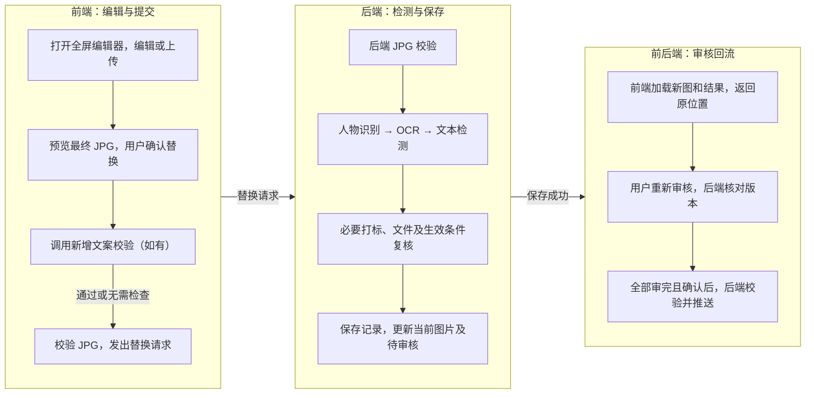

# M-37218【AI生图】[美工+运营]图片二改能力构建（责任人：徐强）

禅道需求：https://pm.zhcxkj.com/zentao/story-view-37218.html

GitHub PRD：https://github.com/xuqiang97/ai-image-prd-hub/blob/main/prd/2026-09/M-37218-image-secondary-editing/README.md

## 编辑器源码与在线演示

编辑器源码仓库：https://github.com/ziziran97/pixelweave-studio

查看代码、已确认操作和接入说明；正式接入版本见第 7 节。

编辑器在线前端演示：https://ziziran97.github.io/pixelweave-studio/

体验已确认交互；仅供演示，不保存到业务任务。

## 修改纪要

| 日期 | 版本 | 修改人 | 主要修改点 |
|---|---|---|---|
| 2026-09-07 | V1.0 | 徐强 | 明确图片二改业务流程、前后端交付职责、文件与检测规则、替换记录、审核推送及验收；编辑器操作细节引用对应源码版本。 |

## 调研纪要

| 日期 | 业务部门 | 角色 | 调研对象（干系人） | 调研内容和结论 |
|---|---|---|---|---|
| 2026-09-07 | - | - | - | 审图需清理违禁文字和图形；业务也会使用传统修图软件、自己的 GPT/谷歌/豆包等 AI 工具，或从 LinkFox 官网、客服获取修复图片，需回到原任务替换并审核。 |

## 业务背景和价值

AI 生成图片可能含有违禁文字、标识或其他需修改的元素。业务需要在线轻量修图，或上传外部处理结果，修好当前图片后继续审核，减少重新生成及另行手动上传后台的操作。

现有生成成图为 JPG，任务由创建人查看、审核和编辑；全部图片完成审核后，由用户确认再推送下游。人物识别、必要元数据打标及“阿里大模型 OCR → 公司内部文本违禁检测”已有能力，本期复用并接入二改流程。

## 需求概述

美工版、运营版在 Tab3「待审核」的沉浸式审图弹窗增加“编辑当前图片”，支持在线编辑和本地 JPG/PNG 上传。PNG 按原尺寸转白底 JPG；两种方式均由用户预览确认后统一检测、保存，更新原任务当前图片并重新审核。

本期保留原图及历次成功替换记录，建设消除使用统计，并落实多窗口替换、旧图审核及任务推送保护。仅处理已有业务图片记录且有可用成图的图片，不增加完全生成失败图片的补录入口。

后续跨系统接入预留可扩展的接入方式、来源信息及统一替换能力；本期不开发外部查询选图、接口推送、候选管理或素材平台。一键消除图中文字、算法图层分离及指令改图留待后续需求。

## 研发流程与职责总览

编辑器前端功能与交互已基本定稿，本期接入须完整保留。前端重点完成 ERP 适配，后端重点完成业务处理与数据闭环；真实服务、保存回流和集中统计仍须联调。研发和测试先看本节，再按对应章节实施、验收。

| 角色 | 已有基础 | 本期需要完成的工作 |
|---|---|---|
| 前端研发（ERP 接入） | 编辑器已提供工具、上传校验、成图预览、问题定位、提交状态和消除事件采集 | 审图入口及全屏承载；业务身份、当前图片与生效基准接入；原文件传递及真实接口联调；异常查询、关闭保护和审核回流；埋点发送、正式构建及版本维护。重点见第 1～5、7 节。 |
| 后端研发 | 已有人物、OCR、文本检测与打标能力 | 权限及文件校验、消除转发、检测与保存串联；替换记录、当前生效图片、结果查询；多窗口替换与审核校验、下游同步；消除事件接收和统计。重点见第 2～7 节。 |
| 算法研发 | 编辑器已有底图、黑白 Mask 及结果约定 | 对齐真实消除接口、限制、失败回执及实际版本/耗时信息，完成消除质量验收。重点见第 2、6 节及源码消除接口说明。 |
| 测试 | 源码仓库已有编辑器专项检查项 | 在美工版、运营版真实 ERP 入口验证本期业务链路、异常、多窗口及下游结果；编辑器细项按交付版本的检查项回归，见第 7 节及文末验收。 |

图中为成功主线。以“发出替换请求”为界：此前校验失败或超时恢复编辑，此后结果未知沿同一 submissionId 查询，不重新提交，详见第 3 节。原始上传文件校验、消除调用发生在编辑过程中，消除统计贯穿使用过程；权限、任务状态、图片版本及跳过条件按正文执行。

## 功能需求

### 1. 入口与编辑边界

美工版、运营版入口均为“AI 生图 → Tab3「待审核」→ 沉浸式大屏审图”。底部固定操作栏从左到右为：“编辑当前图片” → 现有两项自动切换复选框 → “不通过” → “通过”。新增入口使用蓝色描边圆角按钮和铅笔图标，与审核按钮等高，窄窗口不遮挡其他控件。

- 点击直接打开当前图片的全屏编辑弹窗，标题为“自研图像编辑能力”；防止重复打开，失败可重试。参考图和其他生成图片不参与本次编辑。
- 沿用任务创建人的可见和操作权限；无权限、确认推送后或完全无图记录不显示入口，图片未加载可用时禁用。后端独立校验上传和替换权限，文件、检测结果及保存对象始终关联同一业务图片。
- 初始图片使用当前生效成图的原尺寸文件：无二改记录时使用生成成图，有记录时使用最新生效二改图；不使用缩略图，不切回原始存档。缺图、空值、加载失败或尺寸超限时禁用编辑/上传/替换，保留错误、重试和关闭入口，不以示例图或其他来源补位。
- 完整沿用交付版本的消除、绘制、文字、调色、颜色取色、图层及通用编辑操作，具体功能、快捷键、属性控件和布局引用第 7 节源码说明。接入后的能力、状态恢复和文案按该版本回归；范围或交互含义变化须先确认。
- 编辑弹窗打开期间，外层切图、审核、确认推送及对应快捷键不可触发；编辑器快捷键不占用外部输入或其他弹窗。外层关闭、Esc、切图和路由离开须接入既有草稿确认与提交限制，不能直接卸载绕过。
- “上传本地图片”只载入草稿，“替换图片”才提交；无实际内容修改且未上传、仅选区变化，或载入/消除未完成、结果尚未采用时不能替换。有未保存修改、已上传图片、已完成或未完成选区、待处理/待采用结果时，关闭须确认；取消保留草稿，无上述状态则直接返回。
- 对比原图及还原初始以进入本次编辑时的图片为基准，上传不改变该基准；还原需确认且可撤销。图层和撤销历史仅在本次编辑保留，保存后为合成图，不提供可编辑工程、跨次撤销、草稿导出或粘贴换图。
- 图片下载沿用外层审图页面的浏览器右键下载；编辑器画布和图层列表沿用图层菜单，不新增下载按钮或专用下载接口。刷新/关闭标签页的提醒及已提交任务跟踪见第 3 节。

### 2. 图片上传与消除接入

初始图片、本地上传及消除结果的宽、高分别不超过 5000 px，等于上限可通过；范围内保持原始尺寸，不自动缩放、拉伸或裁切。上传图可与原图尺寸不同；此限制不改变生图系统既有原图和历史文件存储规则。

| 文件环节 | 格式及大小要求 |
|---|---|
| 本地上传原文件 | 接受实际编码为 JPG/JPEG 或 PNG、可正常解码的单张图片，不超过 25MB；合法文件不因扩展名或 MIME 标签错误被拒绝，其他格式伪装及损坏文件不放行。 |
| PNG 转换 | 原尺寸铺白底转 JPG，提示透明区域变白；转换后 JPG 同样不超过 25MB，不自动降低质量或缩图。原始 JPG 校验后保留原字节，不在载入时重复压缩。 |
| 消除请求 | 当前底图生成的 JPG、同尺寸不透明黑白 PNG Mask 各不超过 25MB，分别校验编码后大小，不按合计计算。 |
| 初始图片与最终成图 | 初始图片取当前生效成图；最终 JPG 保持当前底图宽高，按第 3、4 节校验。本期不另设统一的 25MB 成图保存上限，服务约束须在接入前对齐。 |

25MB 为 25 × 1024 × 1024 字节，等于上限可通过。前端在解码、转换及载入确认前检查原文件大小，在发送消除前检查源图和 Mask；后端独立执行对应校验。超限明确提示文件和限制，保留已有草稿及选区，不继续对应处理。

原始上传文件须由前后端分别校验实际格式、大小、尺寸及可解码性，PNG 校验转换前原文件。必要校验通过才成为可提交底图；失败保留旧草稿，过期回执不覆盖后续草稿。当前宿主契约只接收最终 JPG，原文件传递、后端回执及草稿/目标关联须在本期补齐，不能用最终成图校验代替。

上传来源可为传统软件、外部 AI 工具、LinkFox 官网或客服，不要求用户填写来源。有草稿或选区、待处理/待采用结果时先确认放弃；确认且校验、载入成功后，才清空旧图层、调色、选区、历史及复制记录。取消或失败保留原草稿；成功后的工具状态沿用编辑器规则，不自动消除。上传可直接替换或继续编辑，均绑定原任务当前图片，不新增候选、不改变类型或位置。

消除接入保留以下结果规则，操作细项和接口示例引用第 7 节：

- 仅处理当前工作底图，源图包含当前调色；新增文字、画笔和图形不进入源图，消除工作区临时隐藏新增内容不改写图层显隐。调色同样仅影响底图。
- Mask 与源图同尺寸，白色区域修改、黑色区域保留；结果须同宽同高，尺寸不符不能采用，不自动缩放或重排新增对象。源图或 Mask 超限不调用算法。
- 结果先预览，明确采用后才更新底图，新增对象继续独立可编辑；采用可撤销，调色不重复叠加。取消等待、放弃或失败保留原画面及选区；有效结果的预览生成/加载失败可重试预览而不再次消除，采用失败保留结果，过期响应不回写。
- 真实样图验收目标清理、残字、背景衔接、商品边缘和选区内外商品一致性；未选中区域的结构、颜色、数量及重要细节不应明显变化。覆盖 2048 × 2048 Listing 图、4392 × 1800 A+ 图及原尺寸调色、消除、成图，无裁切或接缝，不能以缩图规避大图问题。

### 3. 替换检测与异常处理

点击“替换图片”后，前端在既有确认弹窗内本地生成并完整展示最终 JPG，包含当前底图效果及显示开启的新增图层，排除隐藏层、选区和辅助标记。消除工作区也须展示完整成图。生成或加载未完成、失败时不能确认，可重试或取消；旧预览不得覆盖新草稿或用于后续提交。

用户确认后依次执行下表。确认前不发起文案/成图检测或保存；取消保留草稿。修改草稿后须重新预览确认，提交复用已确认的同一份 JPG。在线编辑、直接上传、上传后编辑及再次打开后的连续二改均走同一流程。

| 顺序 | 处理及放行条件 |
|---|---|
| 1. 新增文案 | 校验全部保留的非空新增文字完整内容，包含遮盖、隐藏、锁定及完全透明层；已删除或被换图清空的文字不参与，无新增文案才跳过。仅确认替换后检测，不在输入、停顿或结束编辑时检测，不按字符猜测语言或预先拦截；语言限制另行确认。 |
| 2. 最终 JPG | 前端校验已确认 JPG 的实际编码、可读取性及与当前底图一致的尺寸，通过后发出图片替换请求；后端独立校验通过才继续人物识别，不以上传原文件校验代替。 |
| 3. 人物识别 | 先检测人物，再进入 OCR。识别到人物本身不阻止替换，须完成必要打标；检测失败不继续。 |
| 4. 整图 OCR | 使用现有阿里大模型提取最终成图文字；成功且明确无文字才跳过下一项文本检测，失败或异常不能当作无文字放行。 |
| 5. 图中文字检测 | 将 OCR 文字交给现有公司内部文本违禁检测接口，沿用侵权禁售规则；命中禁止替换，返回问题文字、命中词或原因，保留草稿供修改后再次检测。 |
| 6. 打标及文件复检 | 按本次人物结果及现有规则写入、更新并验证必要元数据，清除不再适用的旧结论；有人物改为无人物及反向变化均须对应。打标不改变确认画面的像素内容，待保存文件须再次通过 JPG、尺寸及可读取性校验。 |
| 7. 保存生效 | 全部适用检查通过，且权限、任务状态及目标图片生效基准仍有效后，按第 4 节保存记录并更新当前图片。 |

新增文案命中时，前端沿用编辑器的问题标记、全部命中词展示及逐层定位，不自动显示或解锁图层；改文案使旧提示失效，改样式不清除，再次确认替换才复检。底图、上传图片及此前已融入图片的文字通过整图 OCR 检测，不要求定位为可编辑文字对象。文字检测不能代替整体图片人工审核。

前端沿用“新增文案 → 图片检测 → 保存图片 → 返回审核”进度，无新增文案标明无需检查。后端按实际阶段回报，不用阶段回报代替最终结果；无阶段时通用等待，乱序及过期回报不误推进。处理满 10 秒显示实际等待秒数，查询及审核回流分别计时，等待用户操作时不计时；不显示推算进度或剩余时间。

| 状态 | 前端操作与后端结果 |
|---|---|
| 处理中 | 禁止编辑、上传、重复提交及通过关闭/取消/Esc/遮罩退出；仅明确持久化成功才进入审核回流。 |
| 提交前失败或后台明确失败 | 替换请求未发出时的校验失败/超时，或文案命中、后台明确失败且不会继续生效时，提示原因并保留草稿，恢复编辑、关闭和重试；原图及审核状态不变，不新增成功记录。提交前失败不进入结果查询，失败/超时不伪装通过。 |
| 替换结果未知 | 请求发出后，因超时、断网、响应丢失或异常回执无法确认最终结果时，无论最后显示检测还是保存，均显示“替换结果待确认”。沿同一 submissionId 查询，不重新发起替换；仍在处理或未知时保持限制。确认失败且不会继续生效才恢复草稿，确认成功则返回审核；同次提交去重，仅对应一条成功记录。 |
| 已保存、审核刷新失败 | 明确显示已保存并保留成功记录，只重试加载审核图片和结果，不再次保存；继续保持编辑及退出限制，加载完成才关闭编辑器。 |

同一图片多窗口编辑时，打开即保留目标图片当时的生效记录或等价版本信息，与实际底图来源分开；上传新图也不能丢失该校验信息。后端在替换提交及生效前核对，同一旧基准的并发提交最多一份生效。已被其他窗口更新时，拒绝旧草稿覆盖，保留草稿并提示返回审图、重开最新图片；返回前确认放弃，不新增成功记录、不自动套用旧编辑。

页面刷新/关闭标签页时，未保存草稿、已完成或未闭合选区、消除任务及结果未确认的提交触发原生离开提醒；取消离开保留，清空选区且无其他草稿/任务时不额外提醒。浏览器不能保证阻止离开，离开、卸载或取消前端请求不等于取消后端保存。宿主须通过业务图片及原提交标识跨页面继续查询，重新进入读取当前生效图片与结果，不只依赖编辑器内存；本期不恢复未保存草稿或跨会话历史。

已明确失败的提交，以及替换请求发出前已放弃或被后续编辑取代的处理，不得稍后自动替换图片。二改沿用本节时机、状态及恢复规则，不直接套用生图阶段的持续重试和任务流转。

### 4. 替换记录与审核回流

后端独立建立图片替换记录表，每次成功替换新增一条，原业务图片关联当前生效记录。表名及字段由后端确定，须保存：

| 信息 | 要求 |
|---|---|
| 目标与成图 | 原业务图片、任务归属、图片类型和位置；本次检测及必要打标后的最终文件地址。目标、成图地址与来源信息分开。 |
| 接入方式与实际底图 | 使用本次上传图继续消除、调色或添加内容仍记“本地上传”，实际底图关联可空；使用进入编辑时的系统图片修改记“在线编辑”，关联该生效记录，无记录时关联原业务生成图。 |
| 已知来源 | 来源系统、来源任务及来源图片标识；未知可空，不要求用户填写或按文件名猜测。 |
| 检测及操作 | 新增文案校验、整图 OCR、文本检测的执行情况/结果及适用 OCR 文字；跳过原因；人物和打标结果；操作人及成功替换时间。 |

上传后还原初始，恢复进入编辑时的系统图片及在线编辑来源，未再修改不能提交；继续修改后关联该系统底图，撤销还原恢复此前草稿、底图及来源。不能按是否点击过上传判定来源。

保存后重开使用上次生效图，继续在线修改沿实际底图保留已知来源，可直接保存或沿关联查询；重新上传不继承旧图来源或旧底图关联，未知来源不阻断。

- 保留第三方原图文件、地址、关联及首次检测结果，保留历次成功替换记录和可读取文件，不覆盖历史、不新增自动清理。成功记录、当前生效关联、图片引用及待审核状态一起生效；失败沿用日志，不新增失败历史表。本期无历史查看、版本对比或恢复入口。
- 最终文件按当前底图原始宽高合成 JPG。隐藏层不成图，锁定只防编辑；消除模式临时隐藏的显示开启图层仍成图。临时对比、选区及辅助线不进入成图或检测。确认的同一份 JPG 用于检测与后续处理，打标后不得再编码丢失标记，记录及下游使用同一最终文件。JPG 质量由研发结合样图确定，不增加用户设置；连续保存不应明显劣化未编辑区域的小字、边缘及颜色。
- 成功后加载当前大图、缩略图、人物标签及文字检测结果，完成才关闭编辑弹窗；停留原图片位置，该图回到待审核，其他图片不变。完成通过/不通过后才按原设置切图，不因替换自动审核或跳图。刷新失败只重试回流并读取后台当前生效结果，加载完成前禁止审核该图。
- 新图不再符合进入时筛选条件，也先保留当前位置供审核；返回列表或主动查询时再应用最新筛选。

审图栏目仍为“图中文本侵权禁售检测结果参考”，只展示当前图片对应结果：未二改时沿用生成成图结果，未检测/异常不伪装通过；二改后展示当前生效记录的整图结果，不能拿新增文案结果或历史最近非空结果代替。OCR 成功无文字时显示“OCR 未识别到文字，无需进行文本侵权禁售检测”。每条成功替换必须完成 OCR，并满足文本检测通过或明确无文字；原图及历史检测结果继续留存。

### 5. 审核、推送与下游一致性

- 确认推送前，待审核、已通过、未通过图片均可二改；成功替换后重新审核，任务暂不满足推送条件。
- 通过/不通过只对用户已查看的图片版本生效。后端在审核生效前核对；图片已被其他窗口替换时拒绝旧图审核，不改变最新审核状态，提示加载最新图片及检测结果后由用户重新审核，不自动沿用旧操作。
- 全部图片完成审核后，用户确认再推送；确认时重新检查完成条件。“全部审完”不等于“全部通过”，选图范围沿用原规则。确认后（含推送中、已推送）禁止编辑，不提供修改或重推；后端在替换提交及生效前校验任务状态，旧页面提交也拒绝。
- 审图大图、缩略图、人物标签、文字检测栏目及筛选统一使用当前生效图片和对应结果；覆盖美工商品图、美工 A+、运营 A+、运营非 A+ 四条下游链路。同步原表当前值或调整读取方式，避免调用方继续读旧图旧结果；原始存档保留，未使用二改的任务及原有查询、筛选、推送选图逻辑保持不变。接口变更须同步调用方及接口文档。

### 6. 消除使用统计

前端采集、ERP 发送、后端接收存储并汇总，用于观察使用量、稳定性、等待耗时和采用情况；事件字段及示例引用第 7 节，不增加独立统计看板、图片样本留存或人工评分。

| 统计内容 | 口径 |
|---|---|
| 请求与结果 | 区分开始准备、实际请求、准备失败，以及请求成功/失败/取消/未结束；空选区点击不算请求，预览重试不增加请求。取得可读取的同尺寸结果才算请求成功；预览生成/加载失败和采用失败单列。 |
| 耗时 | 请求耗时从实际发起计时；首次可看预览从本轮开始计时，含准备、请求、预览及重试等待。算法版本、排队/推理等服务耗时仅在实际返回时记录，缺失留空。 |
| 用户决策 | 成功载入草稿才算采用，明确放弃才算放弃，未选择离开或缺失记录单列未选择/未知；撤销、重做及内部清理不重复计数，同图再次消除不直接判前次失败。 |
| 关联与隔离 | 按事件标识去重、请求标识关联全过程；保留时间、环境、图片尺寸和来源，ERP 补齐业务端、任务及图片标识。测试/正式分开，跨会话同图统计用业务图片标识。 |

后端提供上述数量、耗时及比例的可查询汇总：请求成功率 = 成功 ÷（成功＋失败），取消/未结束单列；决策采用率 = 已展示且采用的结果数 ÷（已展示且采用的结果数＋已展示且放弃的结果数），未成功展示就放弃的结果不计入该分母。分母为 0 显示暂无数据；采用率不等于满意度、最终保存率或画质评分。

接收接口、鉴权、持久化、去重、留存及查询方式由 ERP 与后端落实。采集/发送失败不阻断业务，强制离开可能丢事件，缺失不补算成功或放弃；不采集图片、URL、Mask、文字、账号凭据、Key 或原始敏感错误。本地记录或回调触发不能代替集中统计验收。

### 7. ERP 交付与源码引用

本 PRD 定义业务范围、跨端处理及验收，编辑器 README/AGENTS 维护具体操作、适配器和专项验证。本次对照发布版本为 0449a49，实际接入记录最终采用版本，并核对对应说明；缺陷按已确认规则修复，范围或交互变化先确认再同步。本需求只维护这一份 PRD，不另做入口 HTML 原型。

- 核对真实 ERP 的框架、构建、弹窗、鉴权及图片/审核接口后，选择组件复用或独立正式页面承载，补齐必要公共接口；处理全屏布局、样式/资源路径、焦点及会话清理，外层操作遵守第 1、3 节。当前没有可直接安装的 SDK，尚无对宿主公开的请求关闭接口，不用模拟点击或访问内部私有状态接入。
- 接通原文件校验、目标生效基准、消除、文案/成图检测、真实进度、持久化保存、结果查询、跨页面跟踪、审核版本校验和回流，明确接口鉴权、耗时及成本。前端既有契约不代表这些业务能力已接通；字段及技术方案由研发结合双方代码确定。
- 正式 ERP 使用普通生产构建或等效构建，产物排除演示/测试标识、场景切换、样图、示例入口、测试词及模拟处理，不能只隐藏界面。真实结果预览、采用/放弃、替换确认及进度保留；服务缺失/失败按本文恢复，不回退模拟通过。消除经业务后端转发，能力凭据留服务端；独立演示始终标明未保存到任务。
- 通用编辑能力在源码仓库维护，ERP 适配单独维护。交付采用版本、接入位置、专属改动及更新步骤，保留上一可用版本；首次验证一次受控更新与回退，升级核对兼容并完成两端回归，不自动跟随远端主分支，不覆盖正在编辑或结果未知的提交。

## 风险描述

- 真实消除质量、完整检测/保存/审核链路及集中统计仍须在正式 ERP 入口验收，演示或前端测试通过不能代替。
- Alibaba Sans 与阿里巴巴普惠体日文不随项目 MIT 许可转授权，公开分发范围仍待确认；交付前按源码字体说明核实。
- 范围内大图仍受浏览器解码和内存限制，PNG 转换及多次 JPG 保存可能影响细节；须用实际业务样图验证，失败保留草稿，不以自动缩图规避。

## 验收标准

以下场景分别在美工版和运营版的实际 ERP 入口验收。编辑器工具、文字排版、控件、快捷键、图层及历史细项使用第 7 节所选版本的专项检查项，不在本 PRD 重复列举。

| 场景 | 通过标准 |
|---|---|
| 1. 入口与编辑器接入 | 入口位置及权限符合第 1 节，其他账号不能上传或替换他人任务图片，文件及结果不能串到其他业务图片；首次/再次打开均关联正确当前图，缺图、加载失败和超限可恢复且不载入样图。编辑器能力完整，紧凑布局、宿主样式/快捷键/关闭隔离通过，工具修改结果及原尺寸成图一致。 |
| 2. 上传与文件限制 | 覆盖实际格式、错后缀/MIME、伪装、损坏、透明 PNG 白底转换及失败；前后端校验同一原文件。分别验证 25MB、5000px 边界及消除两文件独立限制；成功才清旧草稿，取消/失败保留，后端原文件未通过不可提交，不串图、不自动缩图。 |
| 3. 消除与图片质量 | 实际源图含调色且不含新增对象，Mask 黑白含义、尺寸及结果按第 2 节；明确采用才生效，预览/采用失败可恢复，预览重试不重复请求，旧结果不回写。业务样图和两类大图验证清理效果、商品一致性、完整原尺寸及连续保存质量。 |
| 4. 预览、检测与打标 | 禁止替换的状态均有效，完整最终图加载后才能确认；确认前不检测保存，提交同一 JPG。新增文字覆盖隐藏/锁定/透明及多图层多词，命中可定位复检；仅无新增文案跳过文案校验，仅 OCR 明确无文字跳过整图文本检测。顺序、必要打标、文件复检及人物有/无变化均符合第 3 节。 |
| 5. 异常与页面离开 | 验证真实/缺失/乱序进度、10 秒等待、提交前失败/超时、检测阶段断网、保存超时、响应丢失、明确失败及审核刷新失败。未知同次查询，已保存只重试回流；刷新/卸载继续跟踪。未闭合选区提醒及取消离开有效，已放弃或明确失败的旧处理不稍后替换。 |
| 6. 记录、来源与并发替换 | 连续成功替换三次保留三条记录、文件及原始存档；第 4 节上传后编辑、还原、撤销、重开及再次上传的来源正确。区分同次请求去重和不同窗口冲突：同一旧基准最多一份生效，上传也受保护，旧草稿被拒绝并保留。 |
| 7. 审核回流与推送 | 新图、缩略图、标签及当前文字结果同步，OCR 无文字文案正确；停留当前位置、仅该图回待审核，筛选变化不自动移走。另一窗口对旧图通过/不通过均被拒绝，加载最新图后重新审核；全部审完且确认后才推送，确认后旧页面不能替换。 |
| 8. 下游一致性 | 用人物有/无变化样例分别核对美工商品图、美工 A+、运营 A+、运营非 A+ 四条链路，文件、必要标记及检测状态与当前生效记录一致；未使用二改的任务保持原流程。 |
| 9. 消除统计 | 事件实际经 ERP 发送并入库，已知样例的数量、耗时、采用率/成功率及分母为 0 按第 6 节；重试和重复事件不重计，缺失不补算，业务端/环境/图片关联正确，接收失败不阻断且不含敏感内容。 |
| 10. 正式交付 | 正式产物排除样图、模拟流程和测试入口，不持有能力服务凭据；真实接口、原文件校验、跨页面查询及审核回流可用。完成版本记录、一次受控更新/回退和字体分发确认，交付相关接口说明及回归结果。 |
